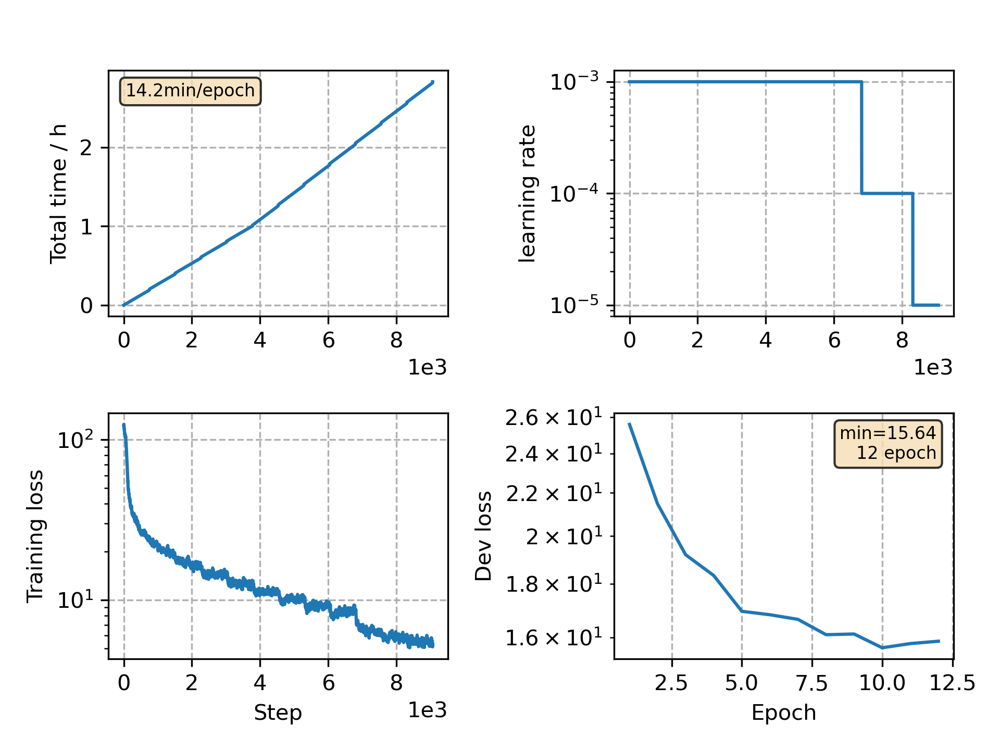

### Basic info

**This part is auto generated, add your details in Appendix**

* Model size/M: 16.82
* GPU info \[3\]
  * \[3\] Tesla P100-PCIE-16GB

### Appendix

* Based on CommonVoice Russian VGGBLSTM model training

### WER
```
%WER 6.17 [ 5077 / 82305, 350 ins, 1749 del, 2978 sub ] exp/VGG/decode_test/wer_16_0.0
```

### Monitor figure

