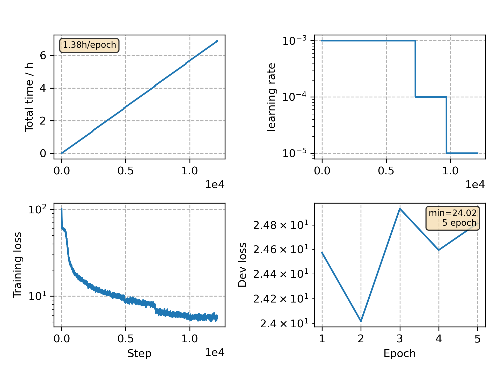

### Basic info

**This part is auto generated, add your details in Appendix**

* Model size/M: 16.82
* GPU info \[2\]
  * \[2\] Tesla P100-PCIE-16GB

### Appendix

* Based on CommonVoice Thai VGGBLSTM model training

### WER
```
%WER 10.92 [ 1518 / 13902, 558 ins, 321 del, 639 sub ] exp/VGG/decode_test/wer_17_1.0
```

### Monitor figure

