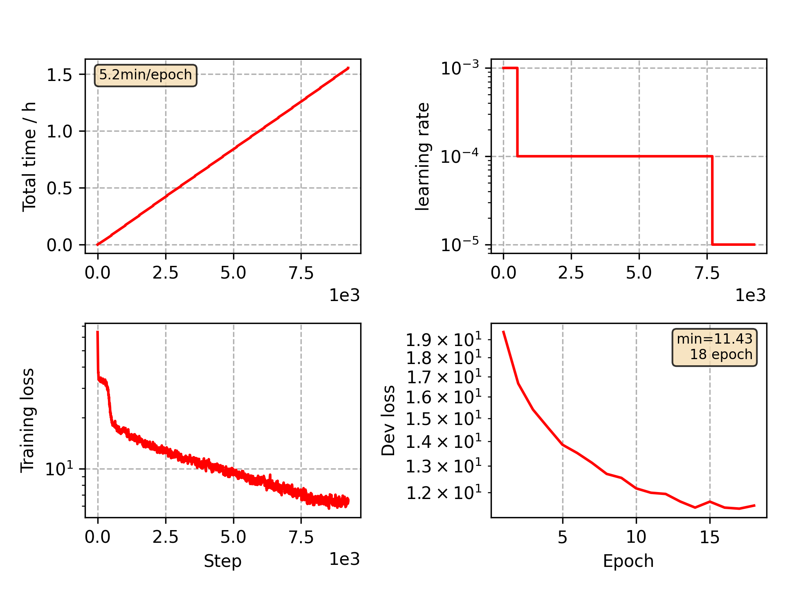

### Basic info

**This part is auto generated, add your details in Appendix**

* Model size/M: 16.74
* GPU info \[4\]
  * \[4\] NVIDIA GeForce GTX 1080

### Appendix

* Based on CommonVoice Taiwan VGGBLSTM model training 

### WER
```
%WER 17.54 [ 810 / 4618, 13 ins, 168 del, 629 sub ] exp/VGG/decode_test/wer_11_0.5
```

### Monitor figure

