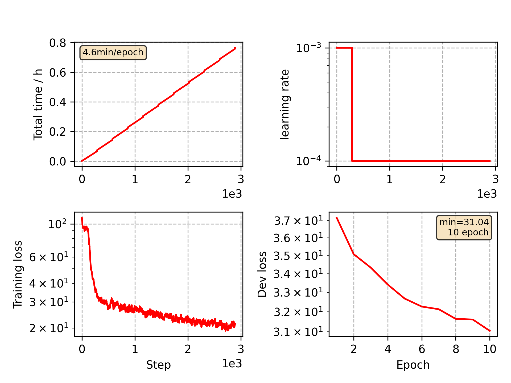

### Basic info

**This part is auto generated, add your details in Appendix**

* Model size/M: 16.70
* GPU info \[5\]
  * \[4\] NVIDIA GeForce GTX 1080
  * \[1\] NVIDIA GeForce GTX 1080 Ti

### Appendix

* Based on CommonVoice Ukrainian VGGBLSTM model training

### WER
```
%WER 15.98 [ 7631 / 47744, 335 ins, 3326 del, 3970 sub ] exp/VGG/decode_test/wer_12_0.5
```

### Monitor figure

