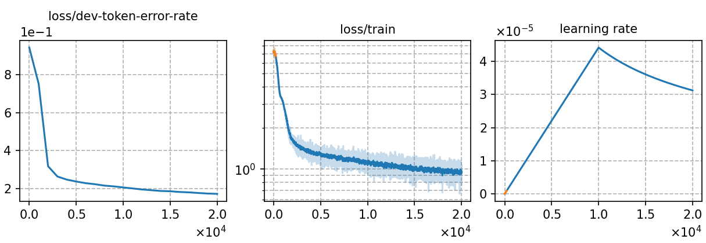

### Basic info

**This part is auto-generated, add your details in Appendix**

* \# of parameters (million): 39.47
* GPU info \[5\]
  * \[5\] NVIDIA GeForce RTX 3090

### Notes

* Use `russian+indonesia` data pretrained model 

### Result
```
trans_graph_ac1.0_lm1.0_wip0.0.hyp      %SER 33.24 | %WER 14.93 [ 3278 / 21951, 409 ins, 454 del, 2415 sub ]
trans_graph_ac1.0_lm1.0_wip0.0.hyp      %SER 21.28 | %WER 7.63 [ 1654 / 21664, 194 ins, 256 del, 1204 sub ]
```

|     training process    |
|:-----------------------:|
||
