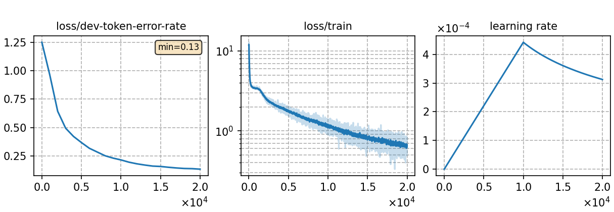

### Basic info

**This part is auto-generated, add your details in Appendix**

* \# of parameters (million): 39.47
* GPU info \[5\]
  * \[5\] NVIDIA GeForce RTX 3090

### Notes

* 

### Result
```

trans_graph_ac1.0_lm1.0_wip0.0.hyp      %SER 30.32 | %WER 14.35 [ 3149 / 21951, 430 ins, 342 del, 2377 sub ]
trans_graph_ac1.0_lm1.0_wip0.0.hyp      %SER 18.62 | %WER 6.92 [ 1500 / 21664, 174 ins, 217 del, 1109 sub ]
```

|     training process    |
|:-----------------------:|
||
