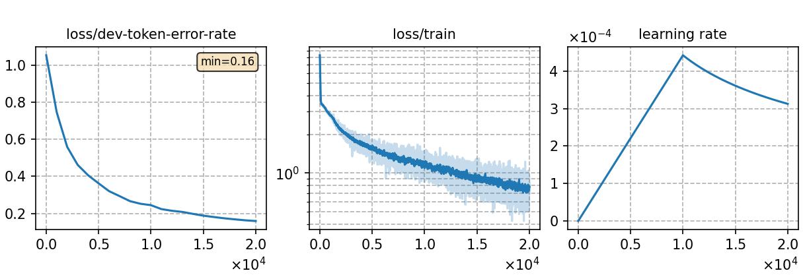

### Basic info

**This part is auto-generated, add your details in Appendix**

* \# of parameters (million): 45.77
* GPU info \[8\]
  * \[8\] NVIDIA GeForce RTX 3090

### Notes

* 

### Result
```
trans_graph_ac1.0_lm1.0_wip0.0.hyp      %SER 31.93 | %WER 15.10 [ 3315 / 21951, 437 ins, 345 del, 2533 sub ]
trans_graph_ac1.0_lm1.0_wip0.0.hyp      %SER 19.41 | %WER 7.11 [ 1540 / 21664, 164 ins, 206 del, 1170 sub ]
```

|     training process    |
|:-----------------------:|
||
