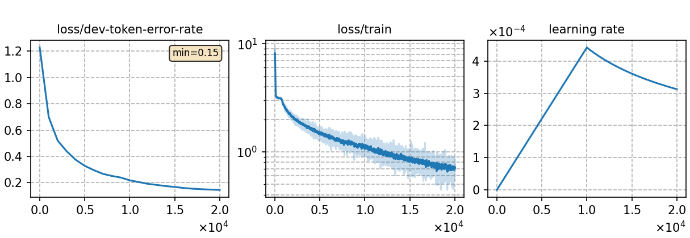

### Basic info

**This part is auto-generated, add your details in Appendix**

* \# of parameters (million): 39.46
* GPU info \[5\]
  * \[5\] NVIDIA GeForce RTX 3090

### Notes

* 

### Result
```
id-dev_ac1.0_lm1.0_wip0.0.hyp      %SER 30.20 | %WER 13.64 [ 2994 / 21951, 385 ins, 374 del, 2235 sub ]
id-test_ac1.0_lm1.0_wip0.0.hyp     %SER 16.89 | %WER 6.25 [ 1353 / 21664, 144 ins, 190 del, 1019 sub ]
```

|     training process    |
|:-----------------------:|
||
