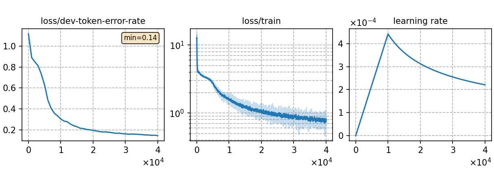

### Basic info

**This part is auto-generated, add your details in Appendix**

* \# of parameters (million): 39.47
* GPU info \[5\]
  * \[5\] NVIDIA GeForce RTX 3090

### Notes

* 

### Result
```
id
id-dev_ac1.0_lm1.0_wip0.0.hyp    %SER 43.52 | %WER 21.99 [ 4827 / 21951, 267 ins, 1249 del, 3311 sub ]
id-test_ac1.0_lm1.0_wip0.0.hyp   %SER 32.90 | %WER 12.89 [ 2792 / 21664, 147 ins, 790 del, 1855 sub ]

ru
ru-dev_ac1.0_lm1.0_wip0.0.hyp    %SER 31.61 | %WER 7.63 [ 6413 / 84022, 460 ins, 2108 del, 3845 sub ]
ru-test_ac1.0_lm1.0_wip0.0.hyp   %SER 36.68 | %WER 9.76 [ 7989 / 81896, 508 ins, 2918 del, 4563 sub ]
```

|     training process    |
|:-----------------------:|
||
