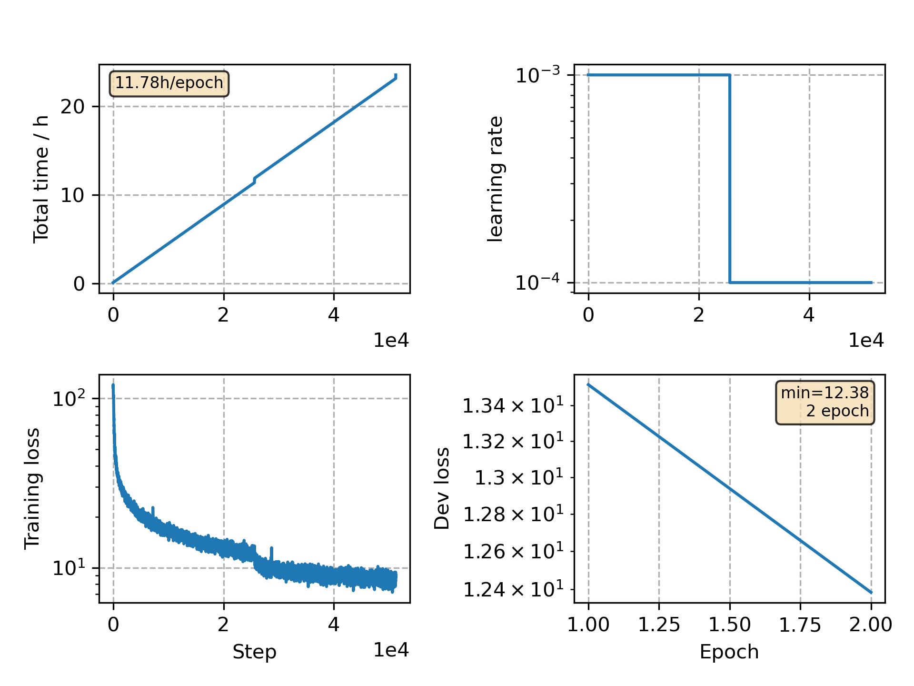

### Basic info

**This part is auto generated, add your details in Appendix**

* Model size/M: 69.69
* GPU info \[3\]
  * \[3\] Tesla P100-PCIE-16GB

### Appendix

* Multilingual training with `Flat-phone` mode on the data pooled of `de`, `fr`, `it` and `es` from CommonVoice 5.1.

* Crosslingual training with `Flat-phone` mode on the data pooled of `pl`, `zh` from CommonVoice 5.1 and aishell-1.

### Multilingual WER

|language|w/o finetune|w/ [finetune](./Finetune)| 
|---|---|---|
|de|14.44|12.88|
|fr|22.99|20.12|
|it|24.58|21.70|
|es|13.87|13.33|

### Crosslingual WER

|language|w/o finetune| w/ [finetune](./Finetune)|
|---|---|---|
|pl|35.12|9.02 (10min)|
|zh|96.96|24.46 (1h)|

### Monitor figure

