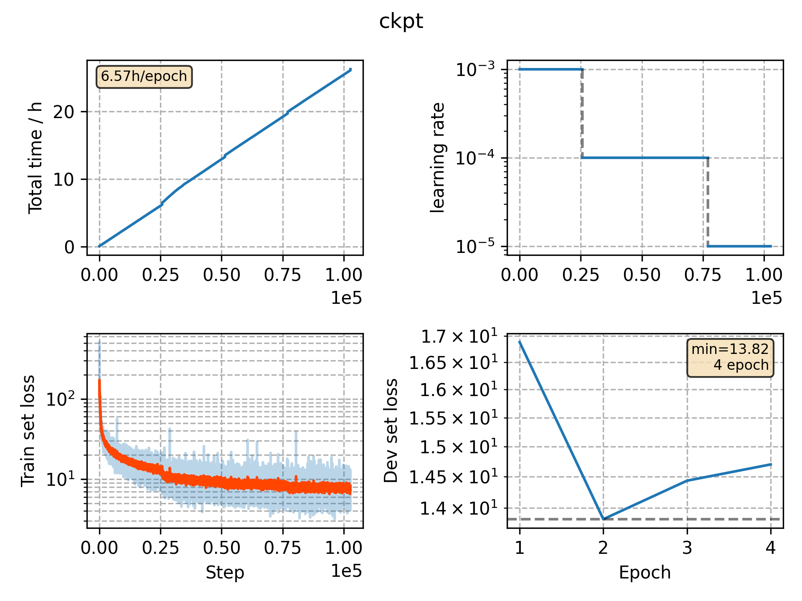

### Basic info

**This part is auto generated, add your details in Appendix**

* Model size/M: 69.63
* GPU info \[3\]
  * \[3\] Tesla P100-PCIE-16GB

### Appendix

* Multilingual training with `JoinAP Linear` mode on the data pooled of `de`, `fr`, `it` and `es` from CommonVoice 5.1.

* Crosslingual training with `JoinAP Linear` mode on the data pooled of `pl`, `zh` from CommonVoice 5.1 and aishell-1.

### Multilingual WER

|language|w/o finetune|w/ [finetune](./Finetune/)|
|---|---|---|
|de|13.70|12.83|
|fr|22.48|20.46|
|it|23.65|21.46|
|es|14.90|13.39|

### Crosslingual WER

|language|w/o finetune| w/ [finetune](./Finetune)|
|---|---|---|
|pl|35.90|7.73 (10min)|
|zh|90.36|23.90 (1h)|

### Monitor figure

