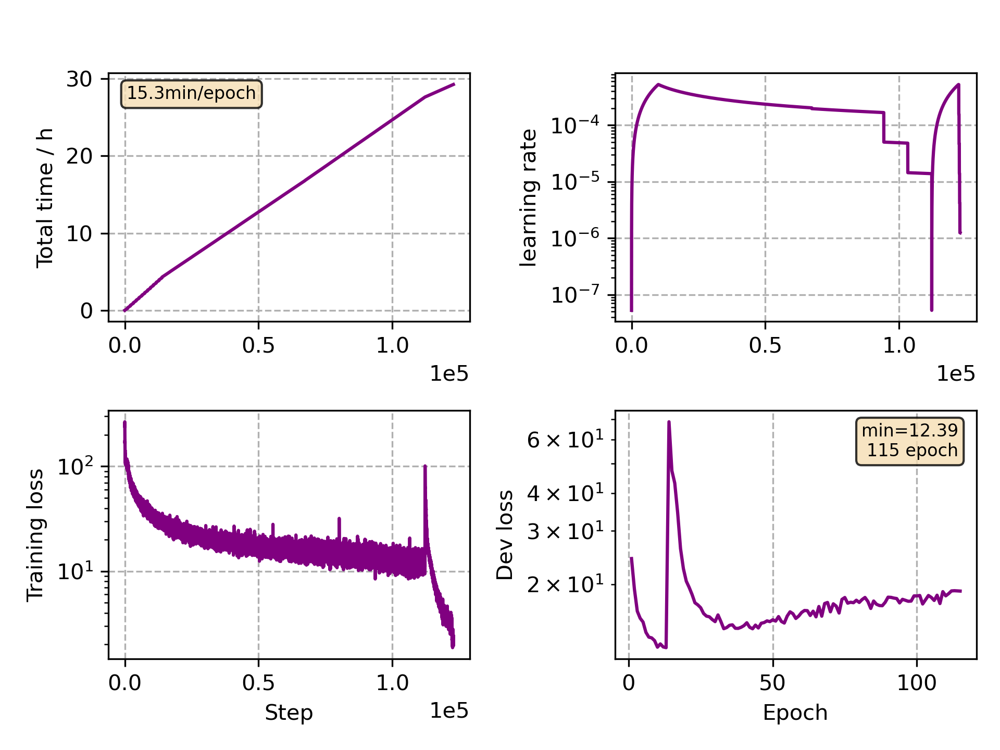

### Basic info

**This part is auto generated, add your details in Appendix**

* Model size/M: 47.67
* GPU info \[10\]
  * \[10\] NVIDIA GeForce RTX 3090

### Appendix

* Crosslingual Finetune Japanese

### WER
```
%WER 18.99 [ 856 / 4508, 508 ins, 8 del, 340 sub ] exp/mc_linear_conformer_new_ja//decode_ja_test_bd_tgpr/wer_17_1.0
```

### Monitor figure

