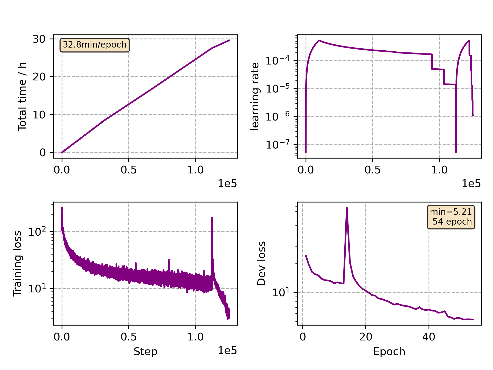

### Basic info

**This part is auto generated, add your details in Appendix**

* Model size/M: 47.67
* GPU info \[10\]
  * \[10\] NVIDIA GeForce RTX 3090

### Appendix

* Crosslingual Finetune Polish

### WER
```
%WER 5.38 [ 1700 / 31588, 65 ins, 1304 del, 331 sub ] exp/mc_linear_conformer_new_pl//decode_pl_test_bd_tgpr/wer_16_0.0
```

### Monitor figure

