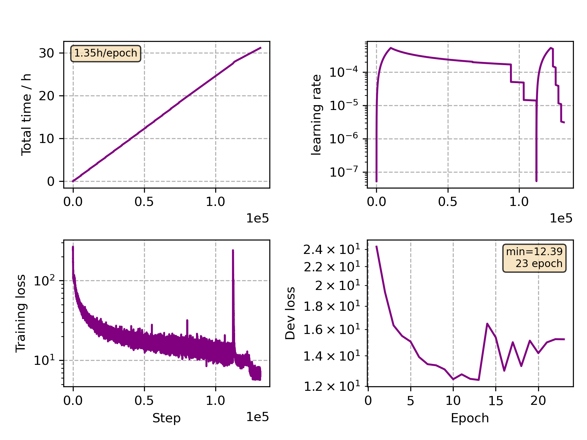

### Basic info

**This part is auto generated, add your details in Appendix**

* Model size/M: 47.67
* GPU info \[10\]
  * \[10\] NVIDIA GeForce RTX 3090

### Appendix

* Multilingual Finetune German

### WER
```
%WER 11.54 [ 15865 / 137510, 3165 ins, 1218 del, 11482 sub ] exp/mc_linear_conformer_new_de//decode_de_test_bd_tgpr/wer_14_0.5
```

### Monitor figure

