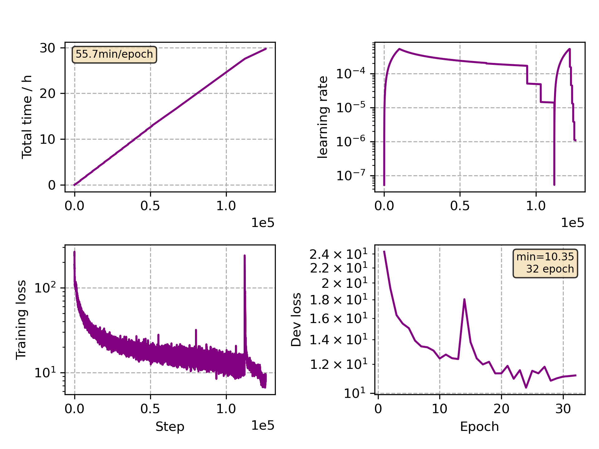

### Basic info

**This part is auto generated, add your details in Appendix**

* Model size/M: 47.67
* GPU info \[10\]
  * \[10\] NVIDIA GeForce RTX 3090

### Appendix

* Multilingual Finetune Spanish

### WER
```
%WER 11.79 [ 17282 / 146566, 2102 ins, 2789 del, 12391 sub ] exp/mc_linear_conformer_new_es//decode_es_test_bd_tgpr/wer_12_1.0
```

### Monitor figure

