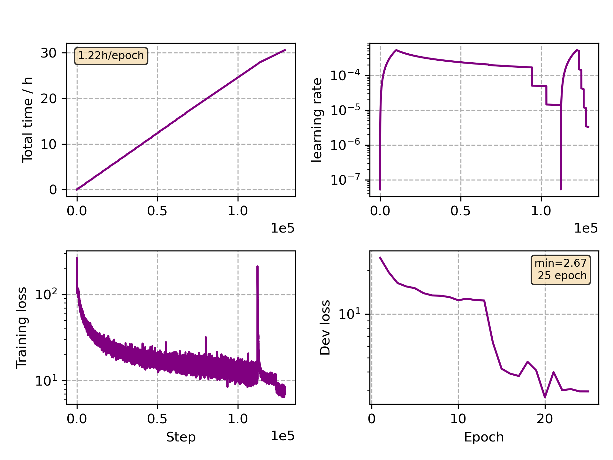

### Basic info

**This part is auto generated, add your details in Appendix**

* Model size/M: 47.67
* GPU info \[10\]
  * \[10\] NVIDIA GeForce RTX 3090

### Appendix

* Multilingual Finetune Fr

### WER
```
%WER 20.48 [ 28242 / 137927, 2562 ins, 3394 del, 22286 sub ] exp/mc_linear_conformer_new_fr//decode_fr_test_bd_tgpr/wer_12_1.0
```

### Monitor figure

