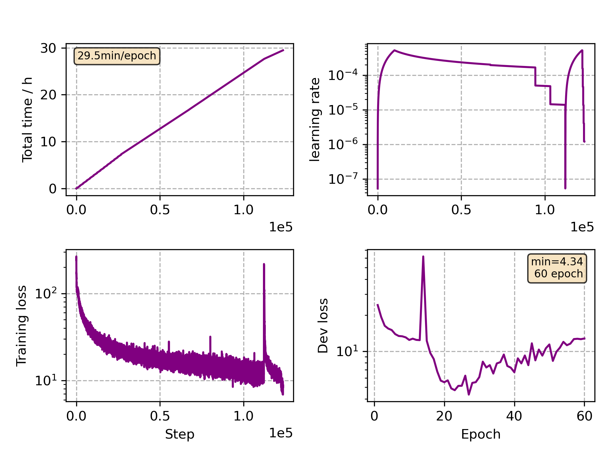

### Basic info

**This part is auto generated, add your details in Appendix**

* Model size/M: 47.67
* GPU info \[10\]
  * \[10\] NVIDIA GeForce RTX 3090

### Appendix

* Multilingual Finetune it

### WER
```
%WER 19.56 [ 22900 / 117099, 3494 ins, 3925 del, 15481 sub ] exp/mc_linear_conformer_new_it//decode_it_test_bd_tgpr/wer_14_1.0
```

### Monitor figure

