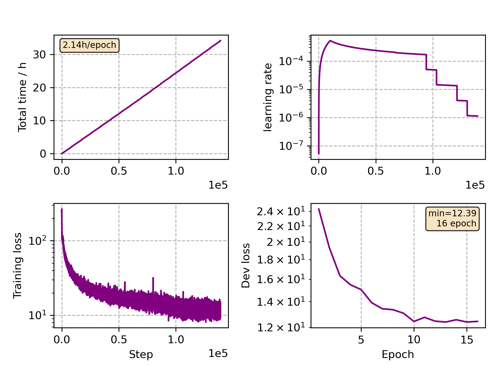

### Basic info

**This part is auto generated, add your details in Appendix**

* Model size/M: 47.68
* GPU info \[8\]
  * \[8\] NVIDIA GeForce RTX 3090

### Appendix

*  Multilingual training with `JoinAP Linear` mode on the data pooled of `de`, `fr`, `it` and `es` from CommonVoice 5.1.

### Multilingual WER

|language|w/ [finetune](./Finetune/)|
|---|-------------------------------|
|de|11.54|
|fr|20.48|
|it|19.56|
|es|11.79|

### Crosslingual WER

|language| w/ [finetune](./Finetune)|
|---|-------------------------------|
|pl|5.38 (1h)|
|ja|18.99 (10h)|

### Monitor figure

