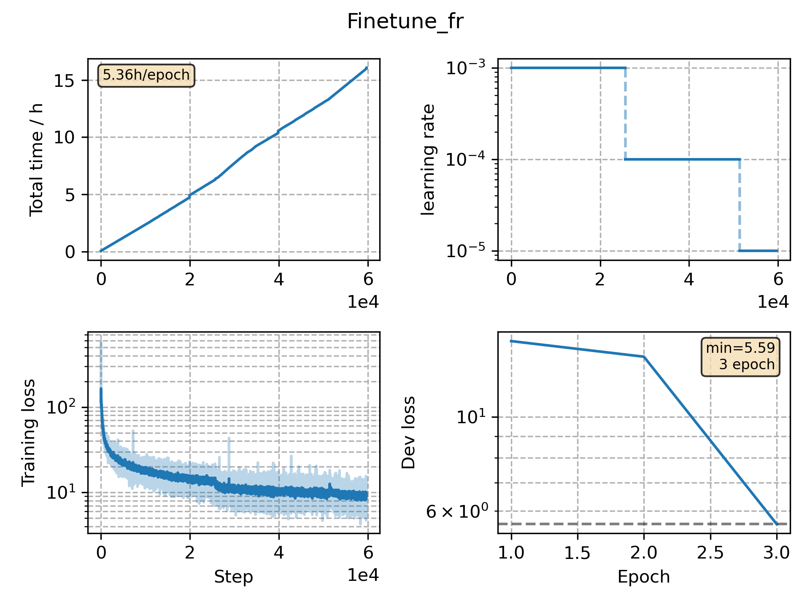

### Basic info

**This part is auto generated, add your details in Appendix**

* Model size/M: 69.63
* GPU info \[5\]
  * \[1\] NVIDIA GeForce GTX 1080 Ti
  * \[4\] NVIDIA GeForce GTX 1080

### Appendix

* Mutilingual Finetune French

### WER
```
%WER 20.59 [ 28400 / 137927, 2522 ins, 4281 del, 21597 sub ] exp/mc_nonlinear_finetune_fr/decode_fr_test_bd_fgconst/wer_11_1.0
```

### Monitor figure

