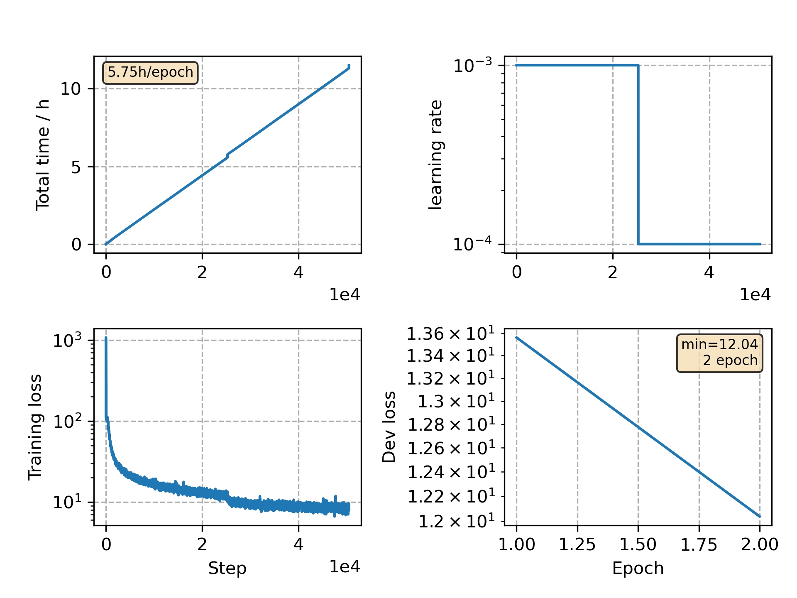

### Basic info

**This part is auto generated, add your details in Appendix**

* Model size/M: 70.59
* GPU info \[5\]
  * \[1\] NVIDIA GeForce GTX 1080 Ti
  * \[4\] NVIDIA GeForce GTX 1080

### Appendix

* Multilingual training with `JoinAP Nonlinear` mode on the data pooled of `de`, `fr`, `it` and `es` from CommonVoice 5.1.

* Crosslingual training with `JoinAP Nonlinear` mode on the data pooled of `pl`, `zh` from CommonVoice 5.1 and aishell-1.

### Multilingual WER

|language|w/ [finetune](./Finetune/)|w/o finetune| 
|---|---|---|
|de|12.89|13.95|
|fr|20.39|24.61|
|it|21.18|24.21|
|es|13.23|15.01|

### Crosslingual WER

|language|w/o finetune| w/ [finetune](./Finetune)|
|---|---|---|
|pl|30.56|8.26 (10min)|
|zh|89.10|23.69 (1h)|

### Monitor figure

