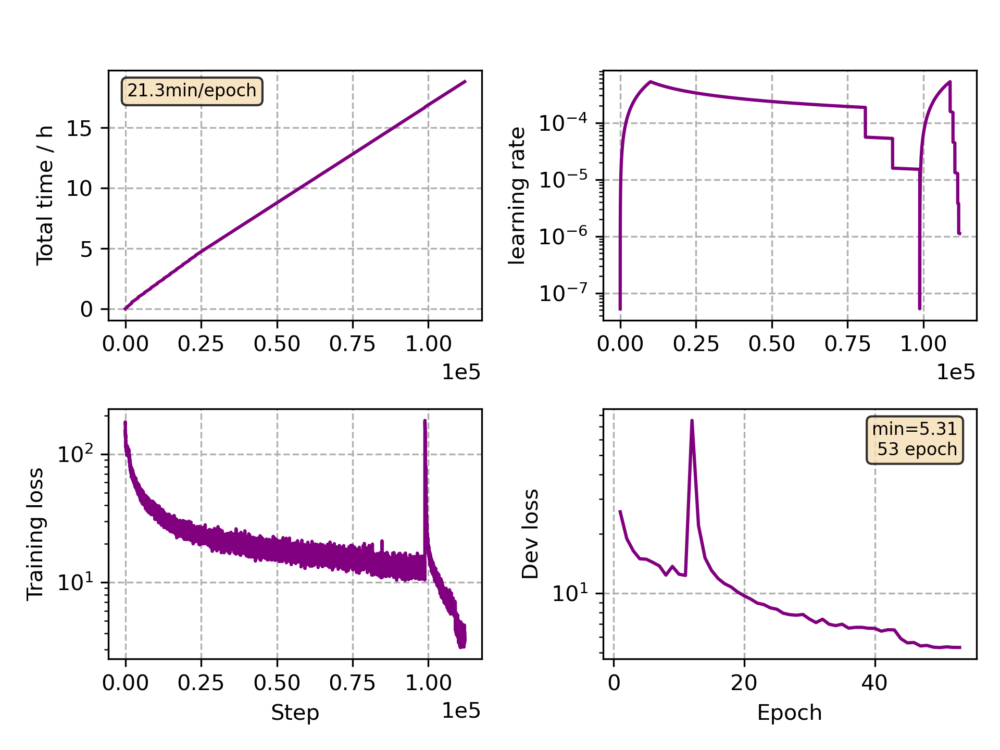

### Basic info

**This part is auto generated, add your details in Appendix**

* Model size/M: 47.86
* GPU info \[10\]
  * \[10\] NVIDIA GeForce RTX 3090

### Appendix

* Crosslingual Finetune Polish

### WER
```
%WER 5.39 [ 1703 / 31588, 70 ins, 1309 del, 324 sub ] exp/mc_nonlinear_conformer_new_pl//decode_pl_test_bd_tgpr/wer_16_0.0
```

### Monitor figure

