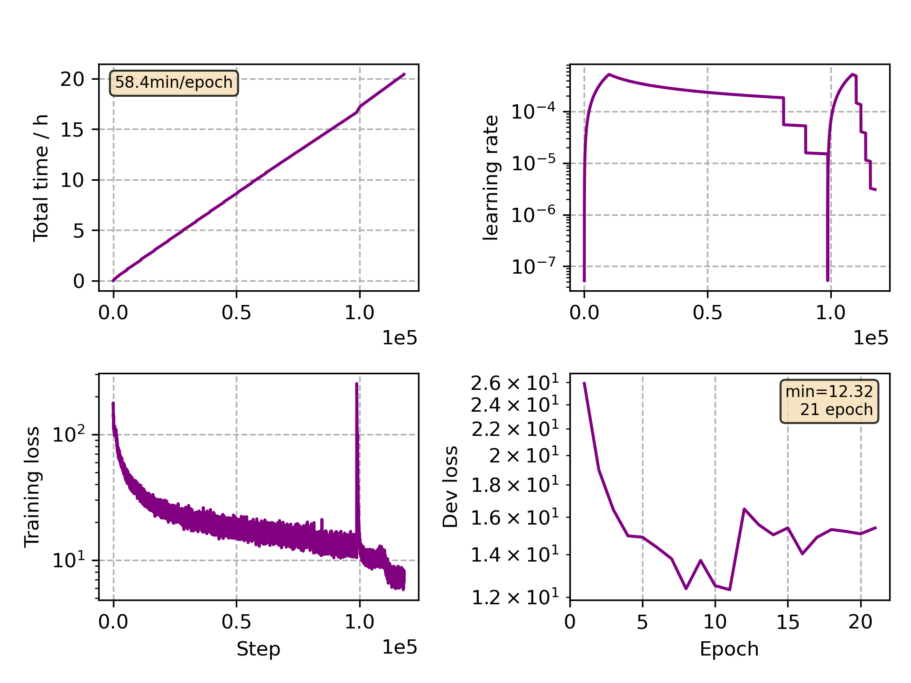

### Basic info

**This part is auto generated, add your details in Appendix**

* Model size/M: 47.86
* GPU info \[10\]
  * \[10\] NVIDIA GeForce RTX 3090

### Appendix

* Multilingual Finetune German

### WER
```
%WER 11.65 [ 16022 / 137510, 3159 ins, 1304 del, 11559 sub ] exp/mc_nonlinear_conformer_new_de//decode_de_test_bd_tgpr/wer_14_0.5
```

### Monitor figure

