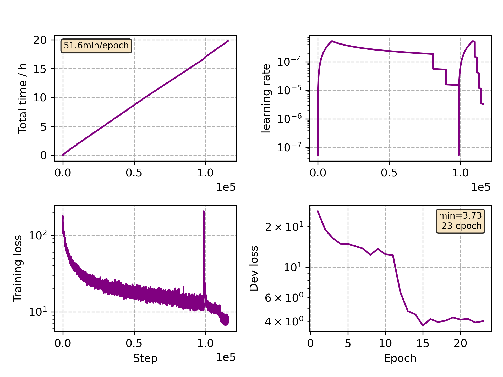

### Basic info

**This part is auto generated, add your details in Appendix**

* Model size/M: 47.86
* GPU info \[10\]
  * \[10\] NVIDIA GeForce RTX 3090

### Appendix

* Mutilingual Finetune French

### WER
```
%WER 20.53 [ 28318 / 137927, 2881 ins, 3101 del, 22336 sub ] exp/mc_nonlinear_conformer_new_fr//decode_fr_test_bd_tgpr/wer_13_0.5
```

### Monitor figure

