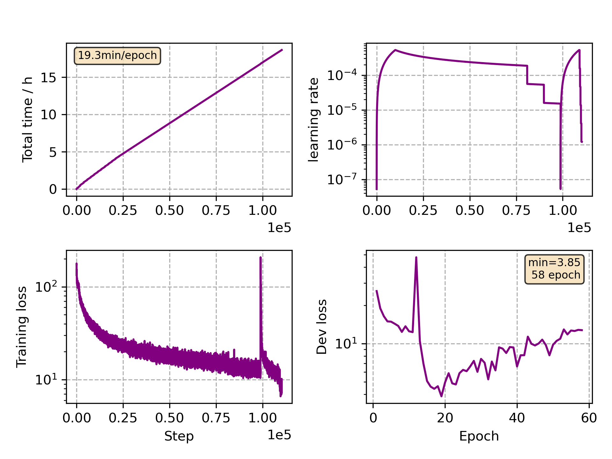

### Basic info

**This part is auto generated, add your details in Appendix**

* Model size/M: 47.86
* GPU info \[10\]
  * \[10\] NVIDIA GeForce RTX 3090

### Appendix

* Multilingual Finetune Italian

### WER
```
%WER 19.60 [ 22946 / 117099, 3257 ins, 4079 del, 15610 sub ] exp/mc_nonlinear_conformer_new_it//decode_it_test_bd_tgpr/wer_15_1.0
```

### Monitor figure

