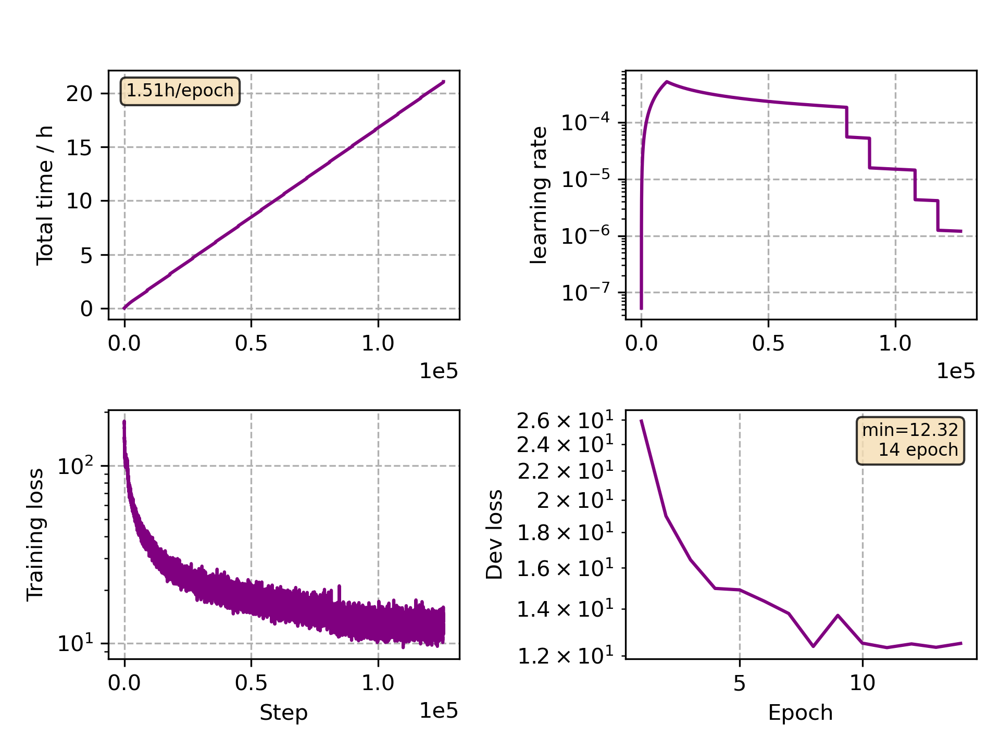

### Basic info

**This part is auto generated, add your details in Appendix**

* Model size/M: 47.87
* GPU info \[10\]
  * \[10\] NVIDIA GeForce RTX 3090

### Appendix

*  Multilingual training with `JoinAP Nonlinear` mode on the data pooled of `de`, `fr`, `it` and `es` from CommonVoice 5.1.

### Multilingual WER

|language|w/ [finetune](./Finetune/)|
|--------|--------------------------|
|de|11.65|
|fr|20.53|
|it|19.60|
|es|11.86|

### Crosslingual WER

|language| w/ [finetune](./Finetune)|
|--------|--------------------------|
|pl|5.39 (1h)|
|ja|20.08 (10h)|

### Monitor figure

