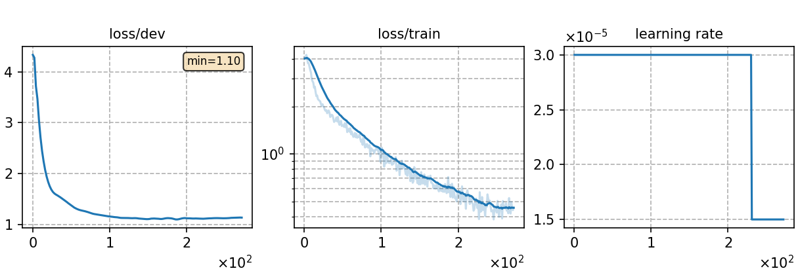

# Fine-tuning Multi. phoneme model in phoneme form with Polish 10 minutes data
Author: Ma, Te (mate153125@gmail.com)
### Basic info

__10 minutes of `Polish`__ data was used to fine-tune the pretrained __phoneme-based multilingual ASR model__ [`Multi._phoneme`](../../../Multilingual/Multi._phoneme/readme.md) in __phoneme__ form. The training dataset was randomly selected from 130 hours Polish dataset sourced from the publicly available [`Common Voice`](https://commonvoice.mozilla.org/) 11.0. 


### Training process

The script [`run.sh`](../../../run.sh) contains the overall model training process.

#### Stage 0: Data preparation
* The data preparation has been implemented in [`monolingual experiments for Polish`](../../../Monolingual/pl/Mono._phoneme_130h/readme.md). Run the script [`subset.sh`](../../../../local/tools/subset.sh) to select any hours of data randomly.
* The detailed model parameters are detailed in [`config.json`](config.json) and [`hyper-p.json`](hyper-p.json). Dataset paths should be added to the [`metainfo.json`](../../../data/metainfo.json) for efficient management of datasets.

#### Stage 1 to 3: Model training
* The training of this model utilized 2 NVIDIA GeForce RTX 3090 GPUs and took 44 minutes. 
  * \# of parameters (million): 89.98
  * GPU info
      * NVIDIA GeForce RTX 3090
      * \# of GPUs: 2

* For fine-tuning experiment, the output layer of the pretrained model need to be matched to the corresponding language before fine-tuning. We train the tokenizer for Polish and run the script [`unpack_mulingual_param.py`](../../../../local/tools/unpack_mulingual_param.py) to implement it. Then configure the parameter `init_model` in `hyper-p.json`.

* To train tokenizer:

        `bash run.sh pl exp/Crosslingual/pl/Multi._phoneme_ft_phoneme_10m --sta 1 --sto 1`
* To fine-tune the model:

        `bash run.sh pl exp/Crosslingual/pl/Multi._phoneme_ft_phoneme_10m --sta 2 --sto 3`
* To plot the training curves:

        `python utils/plot_tb.py exp/Crosslingual/pl/Multi._phoneme_ft_phoneme_10m/log/tensorboard/file -o exp/Crosslingual/pl/Multi._phoneme_ft_phoneme_10m/monitor.png`

|     Monitor figure    |
|:-----------------------:|
||

#### Stage 4: CTC decoding
* To decode with CTC and calculate the %PER:

        `bash run.sh pl exp/Crosslingual/pl/Multi._phoneme_ft_phoneme_10m/ --sta 4 --sto 4`

    ##### %PER
    ```
    test_pl %SER 98.71 | %PER 25.76 [ 76907 / 298549, 13409 ins, 27313 del, 36185 sub ]
    ```

#### Stage 5 to 7: FST decoding
* Before FST decoding, we need to train a language model for each language, which are the same as Monolingual ASR experiment. The configuration files `config.json` and `hyper-p.json` are in the `lm` of corresponding language directory in monolingual ASR experiment. Notice the distinction between the profiles for training the ASR model and the profiles for training the language model, which have the same name but are in different directories.
* To train a language model:

        `bash run.sh pl exp/Crosslingual/pl/Multi._phoneme_ft_phoneme_10m/ --sta 5 --sto 5`

* To decode with FST and calculate the %WER:

        `bash run.sh pl exp/Crosslingual/pl/Multi._phoneme_ft_phoneme_10m/ --sta 6`

    ##### %WER with 4-gram LM
    ```
    test_pl_ac1.0_lm1.7_wip0.0.hyp  %SER 19.21 | %WER 9.68 [ 5756 / 59464, 179 ins, 1835 del, 3742 sub ]
    ```

### Resources
* The files used to fine-tune this model and the fine-tuned model are available in the following table.

    | Pronunciation lexicon | Checkpoint model | Language model | Tensorboard log |
    | ----------- | ----------- | ----------- | ----------- |
    | [`lexicon_pl.txt`](https://cat-ckpt.oss-cn-beijing.aliyuncs.com/cat-multilingual/cv-lang10/dict/pl/lexicon_pl.txt) | [`Multi._phoneme_ft_phoneme_10m_best-3.pt`](https://cat-ckpt.oss-cn-beijing.aliyuncs.com/cat-multilingual/cv-lang10/exp/pl/Multi._phoneme_ft_phoneme_10m_best-3.pt) | [`lm_pl_4gram.arpa`](https://cat-ckpt.oss-cn-beijing.aliyuncs.com/cat-multilingual/cv-lang10/exp/pl/lm_pl_4gram.arpa) | [`tb_Multi._phoneme_ft_phoneme_10m`](https://cat-ckpt.oss-cn-beijing.aliyuncs.com/cat-multilingual/cv-lang10/exp/pl/tb_log_Multi._phoneme_ft_phoneme_10m.tar.gz) |