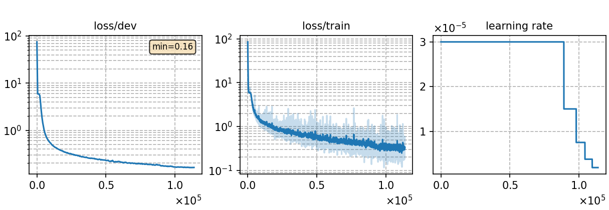

# Fine-tuning Wav2vec-lang10 model in subword form with Polish 130 hours data
Author: Ma, Te (mate153125@gmail.com)
### Basic info

__130 hours of `Polish`__ data was used to fine-tune the pretrained __unsupervised multilingual ASR model for cv-lang10__ [`Wav2vec-lang10`](../../../Multilingual/Wav2vec-lang10/readme.md) in __subword__ form. The training dataset is sourced from the publicly available [`Common Voice`](https://commonvoice.mozilla.org/) 11.0. 


### Training process

The script [`run.sh`](../../../run.sh) contains the overall model training process.

#### Stage 0: Data preparation
* The data preparation has been implemented in [`monolingual experiments for Polish`](../../../Monolingual/pl/Mono._phoneme_130h/readme.md). Run the script [`subset.sh`](../../../../local/tools/subset.sh) to select any hours of data randomly.
* The detailed model parameters are detailed in [`config.json`](config.json) and [`hyper-p.json`](hyper-p.json). Dataset paths should be added to the [`metainfo.json`](../../../data/metainfo.json) for efficient management of datasets.

#### Stage 1 to 3: Model training
* The training of this model utilized 4 NVIDIA GeForce RTX 3090 GPUs and took 19 hours. 
  * \# of parameters (million): 90.55
  * GPU info
      * NVIDIA GeForce RTX 3090
      * \# of GPUs: 4

* For fine-tuning experiment, the output layer of the pretrained model need to be matched to the corresponding language before fine-tuning. We train the tokenizer for Polish and run the script [`unpack_mulingual_param.py`](../../../../local/tools/unpack_mulingual_param.py) to implement it. Then configure the parameter `init_model` in `hyper-p.json`.

* To train tokenizer:

        `bash run.sh pl exp/Crosslingual/pl/Wav2vec-lang10_ft_subword_130h --sta 1 --sto 1`
* To fine-tune the model:

        `bash run.sh pl exp/Crosslingual/pl/Wav2vec-lang10_ft_subword_130h --sta 2 --sto 3`
* To plot the training curves:

        `python utils/plot_tb.py exp/Crosslingual/pl/Wav2vec-lang10_ft_subword_130h/log/tensorboard/file -o exp/Crosslingual/pl/Wav2vec-lang10_ft_subword_130h/monitor.png`

|     Monitor figure    |
|:-----------------------:|
||

#### Stage 4: CTC decoding
* To decode with CTC and calculate the %PER:

        `bash run.sh pl exp/Crosslingual/pl/Wav2vec-lang10_ft_subword_130h/ --sta 4 --sto 4`

    ##### %WER without LM
    ```
    test_pl_raw     %SER 25.67 | %WER 7.49 [ 4454 / 59464, 438 ins, 568 del, 3448 sub ]
    ```

#### Stage 5 to 7: FST decoding
* Before FST decoding, we need to train a language model for each language, which are the same as Monolingual ASR experiment. The configuration files `config.json` and `hyper-p.json` are in the `lm` of corresponding language directory in monolingual ASR experiment. Notice the distinction between the profiles for training the ASR model and the profiles for training the language model, which have the same name but are in different directories.
* To train a language model:

        `bash run.sh pl exp/Crosslingual/pl/Wav2vec-lang10_ft_subword_130h/ --mode subword --sta 5 --sto 5`

* To decode with FST and calculate the %WER:

        `bash run.sh pl exp/Crosslingual/pl/Wav2vec-lang10_ft_subword_130h/ --mode subword --sta 6`

    ##### %WER with 4-gram LM
    ```
    test_pl_raw_ac0.9_lm0.9_wip0.0.hyp      %SER 10.87 | %WER 3.45 [ 2053 / 59464, 134 ins, 416 del, 1503 sub ]
    ```

### Resources
* The files used to fine-tune this model and the fine-tuned model are available in the following table.

    | Word list | Checkpoint model | Language model | Tensorboard log |
    | ----------- | ----------- | ----------- | ----------- |
    | [`wordlist_pl.txt`](https://cat-ckpt.oss-cn-beijing.aliyuncs.com/cat-multilingual/cv-lang10/dict/pl/wordlist_pl.txt) | [`Wav2vec-lang10_ft_subword_130h_best-3.pt`](https://cat-ckpt.oss-cn-beijing.aliyuncs.com/cat-multilingual/cv-lang10/exp/pl/Wav2vec-lang10_ft_subword_130h_best-3.pt) | [`lm_pl_4gram.arpa`](https://cat-ckpt.oss-cn-beijing.aliyuncs.com/cat-multilingual/cv-lang10/exp/pl/lm_pl_4gram.arpa) | [`tb_Wav2vec-lang10_ft_subword_130h`](https://cat-ckpt.oss-cn-beijing.aliyuncs.com/cat-multilingual/cv-lang10/exp/pl/tb_log_Wav2vec-lang10_ft_subword_130h.tar.gz) |


