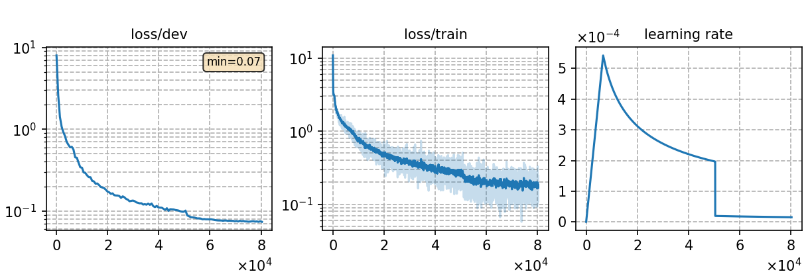

# Monolingual phoneme-based ASR model for Russian
### Basic info

This model is built upon `Conformer` architecture and trained using the `CTC` (Connectionist Temporal Classification) approach. The training dataset consists of __150 hours of `Russian`__ speech data sourced from the publicly available [`Common Voice`](https://commonvoice.mozilla.org/) 11.0.

* \# of parameters (million): 89.98
* GPU info 
  * NVIDIA GeForce RTX 3090
  * \# of GPUs: 3

### Training process

The script [`run.sh`](../../../run.sh) contains the overall model training process.

#### Stage 0: Data preparation
* Follow the steps [`data_prep.md`](../../../local/data_prep.md) and run [`data_prep.sh`](../../../local/data_prep.sh) to prepare the datset and pronunciation lexicon for a given language. The second and fourth stages of `data_prep.sh` involve language-specific special processing, which are detailed in the [`lang_process.md`](../../../lang-process/ru/lang_process.md). 
* The training of this model utilized 3 NVIDIA GeForce RTX 3090 GPUs and took 12 hours. The detailed model parameters are detailed in [`config.json`](config.json) and [`hyper-p.json`](hyper-p.json). Dataset paths should be added to the [`metainfo.json`](../../../data/metainfo.json) for efficient management of datasets.

#### Stage 1 to 3: Model training
* To train the model:

        `bash run.sh ru exp/Monolingual/ru --sta 1 --sto 3`
* To plot the training curves:

        `python utils/plot_tb.py exp/Monolingual/ru/log/tensorboard/file -o exp/Monolingual/ru/monitor.png`

|     Monitor figure    |
|:-----------------------:|
||

#### Stage 4: CTC decoding
* To decode with CTC and calculate the %PER:

        `bash run.sh ru exp/Monolingual/ru --sta 4 --sto 4`

    ##### %PER
    ```
    test_ru %SER 41.56 | %PER 2.72 [ 13614 / 500586, 2169 ins, 5498 del, 5947 sub ]
    ```

#### Stage 5 to 7: FST decoding
* For FST decoding, [`config.json`](./lm/config.json) and [`hyper-p.json`](./lm/hyper-p.json) are needed to train language model. Notice the distinction between the profiles for training the ASR model and the profiles for training the language model, which have the same name but are in different directories.
* To decode with FST and calculate the %WER:

        `bash run.sh ru exp/Monolingual/ru --sta 5`

    ##### %WER
    ```
    test_ru_ac1.0_lm2.5_wip0.0.hyp  %SER 5.50 | %WER 1.62 [ 1310 / 81054, 77 ins, 531 del, 702 sub ]

    ```
### Resources
* The files used to train this model and the trained model are available in the following table. 

    | Tokenizer | Checkpoint model | Language model | Tensorboard log |
    | ----------- | ----------- | ----------- | ----------- |
    | [`Tokenizer`](http://cat-ckpt.oss-cn-beijing.aliyuncs.com/cat-multilingual/cv-lang10/dict/ru/tokenizer.tknz?OSSAccessKeyId=LTAI5tF9KeigLW4UoLbK9vnJ&Expires=2064644929&Signature=Y%2Bb6fEnejL8UlWI8n8QTjvTwz8Q%3D) | [`Mono_ru_best-3.pt`](https://cat-ckpt.oss-cn-beijing.aliyuncs.com/cat-multilingual/cv-lang10/exp/ru/Mono_ru_best-3.pt) | [`lm_ru_4gram.arpa`](https://cat-ckpt.oss-cn-beijing.aliyuncs.com/cat-multilingual/cv-lang10/exp/ru/lm_ru_4gram.arpa) | [`tb_ru`](https://cat-ckpt.oss-cn-beijing.aliyuncs.com/cat-multilingual/cv-lang10/exp/ru/tb_log_ru.tar.gz) |