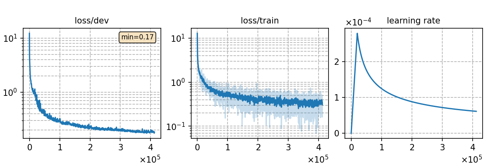

# Multilingual phoneme-based ASR model for 10 languages(Medium)
Author: Ma, Te (mate153125@gmail.com)
### Basic info

This model is built upon `Conformer` architecture and trained using the `CTC` (Connectionist Temporal Classification) approach. The training dataset consists of __4069 hours of `ten languages`__ speech data sourced from the publicly available [`Common Voice`](https://commonvoice.mozilla.org/) 11.0. 


### Training process

The script [`run.sh`](../../../run.sh) contains the overall model training process.

#### Stage 0: Data preparation
* Follow the steps [`data_prep.md`](../../../local/data_prep.md) and run [`data_prep.sh`](../../../local/data_prep.sh) to prepare the datset and pronunciation lexicon for the ten languages as following command. The second and fourth stages of `data_prep.sh` involve language-specific special processing, which are detailed in the [`lang_process.md`](../../../lang-process/) of each language directory.

        `bash run.sh ten exp/Multilingual/Multi._phoneme_M --sta 0 --sto 0`

* For phoneme-based model, a large pronunciation lexicon `lexicon_ten.txt` that contains all words in the multilingual training datasets is needed. Some words may be repeated in the pronunciation lexicon but have different pronunciations because they come from different languages, so we need to add special symbols to distinguish these words. 
* The detailed model parameters are detailed in [`config.json`](config.json) and [`hyper-p.json`](hyper-p.json). Dataset paths should be added to the [`metainfo.json`](../../../data/metainfo.json) for efficient management of datasets. For large training dataset, we should compress this data using the script [`prep_ld.py`](../../../local/tools/prep_ld.py) and configure the parameter `ld` in `hyper-p.json`.

#### Stage 1 to 3: Model training
* The training of this model utilized 10 NVIDIA GeForce RTX 3090 GPUs and took 80 hours.
  * \# of parameters (million): 89.98
  * GPU info
    * NVIDIA GeForce RTX 3090
    * \# of GPUs: 10
  
* To train the model:

        `bash run.sh ten exp/Multilingual/Multi._phoneme_M --sta 1 --sto 3`
* To plot the training curves:

        `python utils/plot_tb.py exp/Multilingual/Multi._phoneme_M/log/tensorboard/file -o exp/Multilingual/Multi._phoneme_M/monitor.png`

|     Monitor figure    |
|:-----------------------:|
||

#### Stage 4: CTC decoding
* To decode with CTC and calculate the %PER:

        `bash run.sh ten exp/Multilingual/Multi._phoneme_M --sta 4 --sto 4`

    ##### %PER
    ```
    test_en_mul     %SER 52.24 | %PER 6.70 [ 42836 / 639098, 7646 ins, 11881 del, 23309 sub ]
    test_es_mul     %SER 46.91 | %PER 2.63 [ 20221 / 769569, 4148 ins, 6633 del, 9440 sub ]
    test_fr_mul     %SER 55.98 | %PER 4.53 [ 26462 / 583591, 5170 ins, 6680 del, 14612 sub ]
    test_it_mul     %SER 56.41 | %PER 3.12 [ 23689 / 758465, 5166 ins, 7636 del, 10887 sub ]
    test_ky_mul     %SER 68.75 | %PER 5.95 [ 3866 / 64972, 648 ins, 1299 del, 1919 sub ]
    test_nl_mul     %SER 56.56 | %PER 3.95 [ 16853 / 427013, 2863 ins, 4508 del, 9482 sub ]
    test_ru_mul     %SER 68.02 | %PER 4.61 [ 23052 / 500586, 3785 ins, 7385 del, 11882 sub ]
    test_sv-SE_mul     %SER 81.74 | %PER 14.81 [ 24509 / 165455, 2838 ins, 5600 del, 16071 sub ]
    test_tr_mul     %SER 56.62 | %PER 6.04 [ 18155 / 300390, 1840 ins, 4444 del, 11871 sub ]
    test_tt_mul     %SER 67.82 | %PER 8.47 [ 13998 / 165304, 1833 ins, 3327 del, 8838 sub ]
    ```

#### Stage 5 to 7: FST decoding
* Before FST decoding, we need to train a language model for each language, which are the same as Monolingual ASR experiment. The configuration files `config.json` and `hyper-p.json` are in the corresponding language directory in monolingual ASR experiment. Notice the distinction between the profiles for training the ASR model and the profiles for training the language model, which have the same name but are in different directories.
* To train a language model for `cv-lang10`:

        `bash run.sh ten exp/Multilingual/Multi._phoneme_M --sta 5 --sto 5`

* To decode with FST and calculate the %WER for `cv-lang10`:

        `bash run.sh ten exp/Multilingual/Multi._phoneme_M --sta 6`

    ##### %WER with 4-gram LM
    ```
    test_en_mul_ac0.9_lm0.9_wip0.0.hyp      %SER 39.14 | %WER 9.83 [ 15119 / 153739, 1380 ins, 2747 del, 10992 sub ]
    test_es_mul_ac0.9_lm0.8_wip0.0.hyp      %SER 39.51 | %WER 7.82 [ 12032 / 153870, 1445 ins, 1937 del, 8650 sub ]
    test_fr_mul_ac0.9_lm0.8_wip0.0.hyp      %SER 56.51 | %WER 14.94 [ 23213 / 155399, 2257 ins, 2575 del, 18381 sub ]
    test_it_mul_ac0.8_lm0.8_wip0.0.hyp      %SER 42.41 | %WER 9.04 [ 13308 / 147151, 1949 ins, 2305 del, 9054 sub ]
    test_ky_mul_ac0.8_lm1.0_wip0.0.hyp      %SER 4.09 | %WER 1.33 [ 145 / 10889, 4 ins, 60 del, 81 sub ]
    test_nl_mul_ac0.8_lm1.0_wip0.0.hyp      %SER 28.58 | %WER 6.57 [ 6260 / 95247, 1295 ins, 740 del, 4225 sub ]
    test_ru_mul_ac0.8_lm1.0_wip0.0.hyp      %SER 6.91 | %WER 1.85 [ 1498 / 81054, 172 ins, 447 del, 879 sub ]
    test_sv-SE_mul_ac0.8_lm1.0_wip0.0.hyp      %SER 16.52 | %WER 6.38 [ 2370 / 37126, 369 ins, 548 del, 1453 sub ]
    test_tr_mul_ac0.8_lm1.0_wip0.0.hyp      %SER 17.06 | %WER 7.43 [ 3831 / 51578, 645 ins, 258 del, 2928 sub ]
    test_tt_mul_ac0.8_lm1.0_wip0.0.hyp      %SER 19.16 | %WER 7.57 [ 2139 / 28256, 384 ins, 164 del, 1591 sub ]
    ```

### Resources
* The files used to train this model and the trained model are available in the following table. The language models in the following table are the same as Monolingual ASR experiment.

    | Tokenizer | Checkpoint model | Language model | Tensorboard log |
    | ----------- | ----------- | ----------- | ----------- |
    | [`Tokenizer`](http://cat-ckpt.oss-cn-beijing.aliyuncs.com/cat-multilingual/cv-lang10/dict/Multi._phoneme/tokenizer_mul10.tknz?OSSAccessKeyId=LTAI5tF9KeigLW4UoLbK9vnJ&Expires=2064643800&Signature=l5orP4V1YtUsK%2BtxfZ3y7Kuh20Q%3D) | [`Multi._phoneme_M_best-3.pt`](http://cat-ckpt.oss-cn-beijing.aliyuncs.com/cat-multilingual/cv-lang10/exp/Multi._phoneme_M/Multi._phoneme_M_best-3.pt?OSSAccessKeyId=LTAI5tF9KeigLW4UoLbK9vnJ&Expires=2064644158&Signature=REyqoKKcg62bgoWjC47ioXuQ4mc%3D) | [`lm_en_4gram.arpa`](https://cat-ckpt.oss-cn-beijing.aliyuncs.com/cat-multilingual/cv-lang10/exp/en/lm_en_4gram.arpa) [`lm_es_4gram.arpa`](https://cat-ckpt.oss-cn-beijing.aliyuncs.com/cat-multilingual/cv-lang10/exp/es/lm_es_4gram.arpa) [`lm_fr_4gram.arpa`](https://cat-ckpt.oss-cn-beijing.aliyuncs.com/cat-multilingual/cv-lang10/exp/fr/lm_fr_4gram.arpa) [`lm_it_4gram.arpa`](https://cat-ckpt.oss-cn-beijing.aliyuncs.com/cat-multilingual/cv-lang10/exp/it/lm_it_4gram.arpa) [`lm_ky_4gram.arpa`](https://cat-ckpt.oss-cn-beijing.aliyuncs.com/cat-multilingual/cv-lang10/exp/ky/lm_ky_4gram.arpa) [`lm_nl_4gram.arpa`](https://cat-ckpt.oss-cn-beijing.aliyuncs.com/cat-multilingual/cv-lang10/exp/nl/lm_nl_4gram.arpa) [`lm_ru_4gram.arpa`](https://cat-ckpt.oss-cn-beijing.aliyuncs.com/cat-multilingual/cv-lang10/exp/ru/lm_ru_4gram.arpa) [`lm_sv-SE_4gram.arpa`](https://cat-ckpt.oss-cn-beijing.aliyuncs.com/cat-multilingual/cv-lang10/exp/sv-SE/lm_sv-SE_4gram.arpa) [`lm_tr_4gram.arpa`](https://cat-ckpt.oss-cn-beijing.aliyuncs.com/cat-multilingual/cv-lang10/exp/tr/lm_tr_4gram.arpa) [`lm_tt_4gram.arpa`](https://cat-ckpt.oss-cn-beijing.aliyuncs.com/cat-multilingual/cv-lang10/exp/tt/lm_tt_4gram.arpa) | [`tb_Multi._phoneme_M`](https://cat-ckpt.oss-cn-beijing.aliyuncs.com/cat-multilingual/cv-lang10/exp/Multi._phoneme_M/tb_Multi._phoneme_M.tar.gz) |