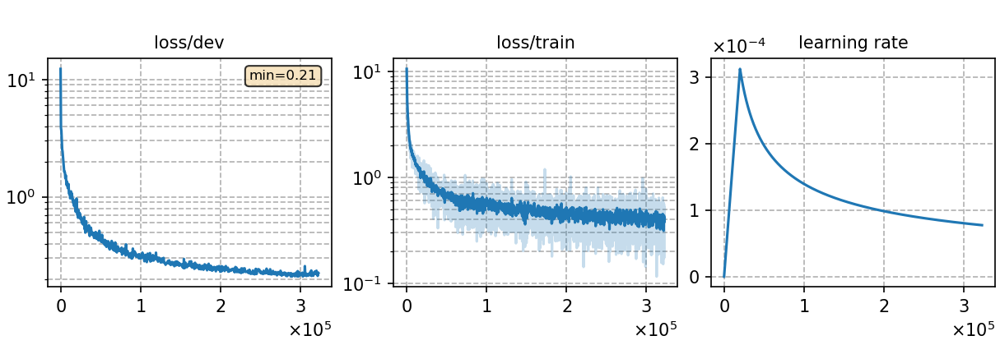

# Multilingual phoneme-based ASR model for 10 languages(Small)
Author: Ma, Te (mate153125@gmail.com)
### Basic info

This model is built upon `Conformer` architecture and trained using the `CTC` (Connectionist Temporal Classification) approach. The training dataset consists of __4069 hours of `ten languages`__ speech data sourced from the publicly available [`Common Voice`](https://commonvoice.mozilla.org/) 11.0. 

### Training process

The script [`run.sh`](../../../run.sh) contains the overall model training process.

#### Stage 0: Data preparation
* Follow the steps [`data_prep.md`](../../../local/data_prep.md) and run [`data_prep.sh`](../../../local/data_prep.sh) to prepare the datset and pronunciation lexicon for the ten languages as following command. The second and fourth stages of `data_prep.sh` involve language-specific special processing, which are detailed in the [`lang_process.md`](../../../lang-process/) of each language directory.

        `bash run.sh ten exp/Multilingual/Multi._phoneme_S --sta 0 --sto 0`

* For phoneme-based model, a large pronunciation lexicon `lexicon_ten.txt` that contains all words in the multilingual training datasets is needed. Some words may be repeated in the pronunciation lexicon but have different pronunciations because they come from different languages, so we need to add special symbols to distinguish these words. 
* The detailed model parameters are detailed in [`config.json`](config.json) and [`hyper-p.json`](hyper-p.json). Dataset paths should be added to the [`metainfo.json`](../../../data/metainfo.json) for efficient management of datasets. For large training dataset, we should compress this data using the script [`prep_ld.py`](../../../local/tools/prep_ld.py) and configure the parameter `ld` in `hyper-p.json`.

#### Stage 1 to 3: Model training
* The training of this model utilized 10 NVIDIA GeForce RTX 3090 GPUs and took 80 hours.
  * \# of parameters (million): 89.98
  * GPU info
    * NVIDIA GeForce RTX 3090
    * \# of GPUs: 10
  
* To train the model:

        `bash run.sh ten exp/Multilingual/Multi._phoneme_S --sta 1 --sto 3`
* To plot the training curves:

        `python utils/plot_tb.py exp/Multilingual/Multi._phoneme_S/log/tensorboard/file -o exp/Multilingual/Multi._phoneme_S/monitor.png`

|     Monitor figure    |
|:-----------------------:|
||

#### Stage 4: CTC decoding
* To decode with CTC and calculate the %PER:

        `bash run.sh ten exp/Multilingual/Multi._phoneme_S --sta 4 --sto 4`

    ##### %PER
    ```
    test_en_mul   %SER 60.50 | %PER 8.02 [ 51273 / 639098, 8437 ins, 14729 del, 28107 sub ]
	test_es_mul   %SER 56.60 | %PER 3.37 [ 25952 / 769569, 4946 ins, 8782 del, 12224 sub ]
	test_fr_mul   %SER 65.44 | %PER 5.68 [ 33150 / 583591, 6146 ins, 8489 del, 18515 sub ]
	test_it_mul   %SER 66.05 | %PER 4.04 [ 30620 / 758465, 6069 ins, 10441 del, 14110 sub ]
	test_ky_mul   %SER 79.11 | %PER 8.29 [ 5389 / 64972, 754 ins, 1722 del, 2913 sub ]
    test_nl_mul   %SER 71.19 | %PER 5.77 [ 24653 / 427013, 3508 ins, 7084 del, 14061 sub ]
	test_ru_mul   %SER 78.08 | %PER 6.05 [ 30285 / 500586, 4578 ins, 9525 del, 16182 sub ]
	test_sv-SE_mul   %SER 88.58 | %PER 18.07 [ 29900 / 165455, 3173 ins, 7310 del, 19417 sub ]
    test_tr_mul   %SER 67.29 | %PER 8.32 [ 24980 / 300390, 2336 ins, 6143 del, 16501 sub ]
	test_tt_mul   %SER 71.99 | %PER 8.53 [ 14108 / 165304, 2083 ins, 3530 del, 8495 sub ]
    ```

#### Stage 5 to 7: FST decoding
* Before FST decoding, we need to train a language model for each language, which are the same as Monolingual ASR experiment. The configuration files `config.json` and `hyper-p.json` are in the corresponding language directory in monolingual ASR experiment. Notice the distinction between the profiles for training the ASR model and the profiles for training the language model, which have the same name but are in different directories.
* To train a language model for `cv-lang10`:

        `bash run.sh ten exp/Multilingual/Multi._phoneme_S --sta 5 --sto 5`

* To decode with FST and calculate the %WER for `cv-lang10`:

        `bash run.sh ten exp/Multilingual/Multi._phoneme_S --sta 6`

    ##### %WER with 4-gram LM
    ```
    test_en_mul_ac0.9_lm0.9_wip0.0.hyp      %SER 39.14 | %WER 9.83 [ 15119 / 153739, 1380 ins, 2747 del, 10992 sub ]
    test_es_mul_ac0.9_lm0.8_wip0.0.hyp      %SER 39.51 | %WER 7.82 [ 12032 / 153870, 1445 ins, 1937 del, 8650 sub ]
    test_fr_mul_ac0.9_lm0.8_wip0.0.hyp      %SER 56.51 | %WER 14.94 [ 23213 / 155399, 2257 ins, 2575 del, 18381 sub ]
    test_it_mul_ac0.8_lm0.8_wip0.0.hyp      %SER 42.41 | %WER 9.04 [ 13308 / 147151, 1949 ins, 2305 del, 9054 sub ]
    test_ky_mul_ac1.0_lm3.8_wip0.0.hyp      %SER 1.86 | %WER 0.91 [ 99 / 10889, 0 ins, 71 del, 28 sub ]
    test_nl_mul_ac0.8_lm1.0_wip0.0.hyp      %SER 28.58 | %WER 6.57 [ 6260 / 95247, 1295 ins, 740 del, 4225 sub ]
    test_ru_mul_ac1.0_lm1.9_wip0.0.hyp      %SER 5.85 | %WER 1.65 [ 1337 / 81054, 89 ins, 491 del, 757 sub ]
    test_sv_mul_ac1.0_lm2.1_wip0.0.hyp      %SER 13.16 | %WER 5.65 [ 2099 / 37126, 166 ins, 694 del, 1239 sub ]
    test_tr_mul_ac1.0_lm1.6_wip0.0.hyp      %SER 17.15 | %WER 7.27 [ 3749 / 51578, 467 ins, 348 del, 2934 sub ]
    test_tt_mul_ac1.0_lm1.7_wip0.0.hyp      %SER 19.24 | %WER 7.37 [ 2083 / 28256, 260 ins, 230 del, 1593 sub ]
    ```

### Resources
* The files used to train this model and the trained model are available in the following table. The language models in the following table are the same as Monolingual ASR experiment.

    | Pronunciation lexicon | Checkpoint model | Language model | Tensorboard log |
    | ----------- | ----------- | ----------- | ----------- |
    | [`lexicon_mul10.txt`](https://cat-ckpt.oss-cn-beijing.aliyuncs.com/cat-multilingual/cv-lang10/dict/Multi._phoneme/lexicon_mul10.txt) | [`Multi._phoneme_S_best-3.pt`](https://cat-ckpt.oss-cn-beijing.aliyuncs.com/cat-multilingual/cv-lang10/exp/Multi._phoneme_S/Multi._phoneme_S_best-3.pt) | [`lm_en_4gram.arpa`](https://cat-ckpt.oss-cn-beijing.aliyuncs.com/cat-multilingual/cv-lang10/exp/en/lm_en_4gram.arpa) [`lm_es_4gram.arpa`](https://cat-ckpt.oss-cn-beijing.aliyuncs.com/cat-multilingual/cv-lang10/exp/es/lm_es_4gram.arpa) [`lm_fr_4gram.arpa`](https://cat-ckpt.oss-cn-beijing.aliyuncs.com/cat-multilingual/cv-lang10/exp/fr/lm_fr_4gram.arpa) [`lm_it_4gram.arpa`](https://cat-ckpt.oss-cn-beijing.aliyuncs.com/cat-multilingual/cv-lang10/exp/it/lm_it_4gram.arpa) [`lm_ky_4gram.arpa`](https://cat-ckpt.oss-cn-beijing.aliyuncs.com/cat-multilingual/cv-lang10/exp/ky/lm_ky_4gram.arpa) [`lm_nl_4gram.arpa`](https://cat-ckpt.oss-cn-beijing.aliyuncs.com/cat-multilingual/cv-lang10/exp/nl/lm_nl_4gram.arpa) [`lm_ru_4gram.arpa`](https://cat-ckpt.oss-cn-beijing.aliyuncs.com/cat-multilingual/cv-lang10/exp/ru/lm_ru_4gram.arpa) [`lm_sv-SE_4gram.arpa`](https://cat-ckpt.oss-cn-beijing.aliyuncs.com/cat-multilingual/cv-lang10/exp/sv-SE/lm_sv-SE_4gram.arpa) [`lm_tr_4gram.arpa`](https://cat-ckpt.oss-cn-beijing.aliyuncs.com/cat-multilingual/cv-lang10/exp/tr/lm_tr_4gram.arpa) [`lm_tt_4gram.arpa`](https://cat-ckpt.oss-cn-beijing.aliyuncs.com/cat-multilingual/cv-lang10/exp/tt/lm_tt_4gram.arpa) | [`tb_Multi._phoneme_S`](https://cat-ckpt.oss-cn-beijing.aliyuncs.com/cat-multilingual/cv-lang10/exp/Multi._phoneme_S/tb_Multi._phoneme_S.tar.gz) |