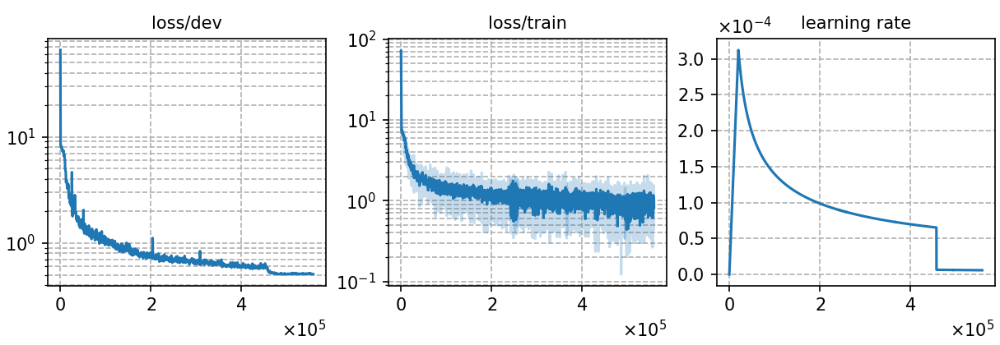

# Multilingual subword-based ASR model for 10 languages
Author: Ma, Te (mate153125@gmail.com)
### Basic info

This model is built upon `Conformer` architecture and trained using the `CTC` (Connectionist Temporal Classification) approach. The training dataset consists of __4069 hours of `ten languages`__ speech data sourced from the publicly available [`Common Voice`](https://commonvoice.mozilla.org/) 11.0. 

### Training process

The script [`run.sh`](../../../run.sh) contains the overall model training process.

#### Stage 0: Data preparation
* Follow the steps [`data_prep.md`](../../../local/data_prep.md) and run [`data_prep.sh`](../../../local/data_prep.sh) to prepare the datset and word list for the ten languages as following command. The second and fourth stages of `data_prep.sh` involve language-specific special processing, which are detailed in the [`lang_process.md`](../../../lang-process/) of each language directory.

        `bash run.sh ten --sta 0 --sto 0`

* For subword-based model, the amount of training data for each language will affect the distribution of sub-words in the vocabulary. In order to alleviate this effect, multinomial distribution random sampling of data from different languages is needed to balance the data before generating the vocabulary. The script of balance the data is [`sample_data.py`](../../../local/tools/sample_data.py)
* The detailed model parameters are detailed in [`config.json`](config.json) and [`hyper-p.json`](hyper-p.json). Dataset paths should be added to the [`metainfo.json`](../../../data/metainfo.json) for efficient management of datasets. For large training dataset, we should compress this data using the script [`prep_ld.py`](../../../local/tools/prep_ld.py) and configure the parameter `ld` in `hyper-p.json`.

#### Stage 1 to 3: Model training
* The training of this model utilized 10 NVIDIA GeForce RTX 3090 GPUs and took 110 hours. 
  * \# of parameters (million): 92.52
  * GPU info
      * NVIDIA GeForce RTX 3090
      * \# of GPUs: 10

* To train the model:

        `bash run.sh ten exp/Multilingual/Multi._subword --sta 1 --sto 3`
* To plot the training curves:

        `python utils/plot_tb.py exp/Multilingual/Multi._subword/log/tensorboard/file -o exp/Multilingual/Multi._subword/monitor.png`

|     Monitor figure    |
|:-----------------------:|
||

#### Stage 4: CTC decoding
* To decode with CTC and calculate the %PER:

        `bash run.sh ten exp/Multilingual/Multi._subword --sta 4 --sto 4`

    ##### %WER without LM
    ```
    test_en %SER 64.44 | %WER 18.87 [ 29009 / 153739, 3224 ins, 2853 del, 22932 sub ]
    test_es %SER 69.41 | %WER 16.74 [ 25758 / 153870, 2825 ins, 2874 del, 20059 sub ]
    test_fr %SER 78.44 | %WER 20.83 [ 32375 / 155399, 2634 ins, 2293 del, 27448 sub ]
    test_it %SER 72.99 | %WER 18.34 [ 26987 / 147151, 3145 ins, 3155 del, 20687 sub ]
    test_ky %SER 92.44 | %WER 44.45 [ 4840 / 10889, 439 ins, 345 del, 4056 sub ]
    test_nl %SER 84.10 | %WER 27.57 [ 26255 / 95247, 4535 ins, 1934 del, 19786 sub ]
    test_ru %SER 87.10 | %WER 35.14 [ 28485 / 81054, 3345 ins, 2816 del, 22324 sub ]
    test_sv-SE %SER 88.26 | %WER 48.34 [ 17948 / 37126, 2776 ins, 1389 del, 13783 sub ]
    test_tr %SER 73.73 | %WER 39.30 [ 20269 / 51578, 2171 ins, 1218 del, 16880 sub ]
    test_tt %SER 89.01 | %WER 54.20 [ 15315 / 28256, 1450 ins, 1070 del, 12795 sub ]
    ```

#### Stage 5 to 7: FST decoding
* Before FST decoding, we need to train a language model for each language, which are the same as Monolingual ASR experiment. The configuration files `config.json` and `hyper-p.json` are in the corresponding language directory in monolingual ASR experiment. Notice the distinction between the profiles for training the ASR model and the profiles for training the language model, which have the same name but are in different directories.
* To train a language model for `{lang}`:

        `bash run.sh ten exp/Multilingual/{lang} --sta 5 --sto 5`

* To decode with FST and calculate the %WER for `{lang}`:

        `bash run.sh ten exp/Multilingual/Multi._subword --sta 6`

    ##### %WER with 4-gram LM
    ```
    test_en_ac1.0_lm0.5_wip0.0.hyp  %SER 45.98 | %WER 12.00 [ 18447 / 153739, 1043 ins, 5501 del, 11903 sub ]
    test_es_ac1.0_lm0.4_wip0.0.hyp  %SER 50.06 | %WER 9.82 [ 15113 / 153870, 1003 ins, 3804 del, 10306 sub ]
    test_fr_ac1.0_lm0.6_wip0.0.hyp  %SER 55.00 | %WER 12.40 [ 19273 / 155399, 746 ins, 4731 del, 13796 sub ]
    test_it_ac1.0_lm0.5_wip0.0.hyp  %SER 50.01 | %WER 9.98 [ 14687 / 147151, 799 ins, 4423 del, 9465 sub ]
    test_ky_ac1.0_lm1.5_wip0.0.hyp  %SER 6.01 | %WER 3.29 [ 358 / 10889, 2 ins, 328 del, 28 sub ]
    test_nl_ac1.0_lm0.7_wip0.0.hyp  %SER 39.39 | %WER 9.67 [ 9212 / 95247, 1154 ins, 2539 del, 5519 sub ]
    test_ru_ac1.0_lm1.3_wip0.0.hyp  %SER 10.86 | %WER 3.31 [ 2682 / 81054, 28 ins, 1848 del, 806 sub ]
    test_sv_ac1.0_lm1.1_wip0.0.hyp  %SER 23.61 | %WER 9.95 [ 3694 / 37126, 79 ins, 2312 del, 1303 sub ]
    test_tr_ac1.0_lm0.8_wip0.0.hyp  %SER 22.27 | %WER 9.11 [ 4698 / 51578, 258 ins, 1412 del, 3028 sub ]
    test_tt_ac1.0_lm0.9_wip0.0.hyp  %SER 31.79 | %WER 13.56 [ 3831 / 28256, 92 ins, 1767 del, 1972 sub ]
    ```

### Resources
* The files used to train this model and the trained model are available in the following table. The language models in the following table are the same as Monolingual ASR experiment.

    | Tokenizer | Checkpoint model | Language model | Tensorboard log |
    | ----------- | ----------- | ----------- | ----------- |
    | [`Tokenizer`](http://cat-ckpt.oss-cn-beijing.aliyuncs.com/cat-multilingual/cv-lang10/dict/Multi._subword/tokenizer_bpe5000.tknz?OSSAccessKeyId=LTAI5tF9KeigLW4UoLbK9vnJ&Expires=2064643972&Signature=iC3AIM8%2Be6kE09deKmhoRUf%2BAMA%3D) | [`Multi._subword_best-3.pt`](http://cat-ckpt.oss-cn-beijing.aliyuncs.com/cat-multilingual/cv-lang10/exp/Multi._subword/Multi._subword_best-3.pt?OSSAccessKeyId=LTAI5tF9KeigLW4UoLbK9vnJ&Expires=2064644401&Signature=qfm4pJLvUuIZ2l%2FNTUVer9pC17g%3D) | [`lm_en_4gram.arpa`](https://cat-ckpt.oss-cn-beijing.aliyuncs.com/cat-multilingual/cv-lang10/exp/en/lm_en_4gram.arpa) [`lm_es_4gram.arpa`](https://cat-ckpt.oss-cn-beijing.aliyuncs.com/cat-multilingual/cv-lang10/exp/es/lm_es_4gram.arpa) [`lm_fr_4gram.arpa`](https://cat-ckpt.oss-cn-beijing.aliyuncs.com/cat-multilingual/cv-lang10/exp/fr/lm_fr_4gram.arpa) [`lm_it_4gram.arpa`](https://cat-ckpt.oss-cn-beijing.aliyuncs.com/cat-multilingual/cv-lang10/exp/it/lm_it_4gram.arpa) [`lm_ky_4gram.arpa`](https://cat-ckpt.oss-cn-beijing.aliyuncs.com/cat-multilingual/cv-lang10/exp/ky/lm_ky_4gram.arpa) [`lm_nl_4gram.arpa`](https://cat-ckpt.oss-cn-beijing.aliyuncs.com/cat-multilingual/cv-lang10/exp/nl/lm_nl_4gram.arpa) [`lm_ru_4gram.arpa`](https://cat-ckpt.oss-cn-beijing.aliyuncs.com/cat-multilingual/cv-lang10/exp/ru/lm_ru_4gram.arpa) [`lm_sv-SE_4gram.arpa`](https://cat-ckpt.oss-cn-beijing.aliyuncs.com/cat-multilingual/cv-lang10/exp/sv-SE/lm_sv-SE_4gram.arpa) [`lm_tr_4gram.arpa`](https://cat-ckpt.oss-cn-beijing.aliyuncs.com/cat-multilingual/cv-lang10/exp/tr/lm_tr_4gram.arpa) [`lm_tt_4gram.arpa`](https://cat-ckpt.oss-cn-beijing.aliyuncs.com/cat-multilingual/cv-lang10/exp/tt/lm_tt_4gram.arpa) | [`tb_Multi._subword`](https://cat-ckpt.oss-cn-beijing.aliyuncs.com/cat-multilingual/cv-lang10/exp/Multi._subword/tb_Multi._subword.tar.gz) |