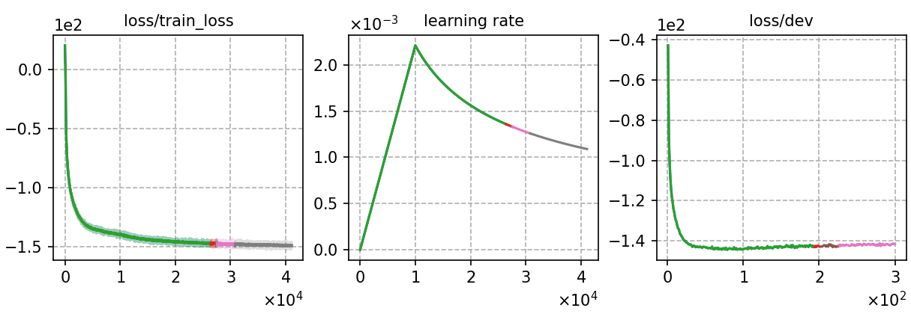

### Basic info

**This part is auto-generated, add your details in Appendix**

* Model size/M: 115.12
* GPU info \[10\]
  * \[10\] NVIDIA GeForce RTX 3090

### Notes

- data prep: kaldi + cmvn by spk
- Same encoder as `rnnt-v1`, trained with CTC-CRF phone-based
- This experiment is originally conducted on old code base, so it's not guaranteed to precisely reproduce the results.

### Result
```
model averaging on last 10 of the checkpoints
%WER 2.42 [ 1317 / 54402, 139 ins, 227 del, 951 sub ] exp/crf-v2/fglarge/dev_clean/wer_12_1.0
%WER 5.30 [ 2698 / 50948, 264 ins, 399 del, 2035 sub ] exp/crf-v2/fglarge/dev_other/wer_17_0.0
%WER 2.63 [ 1383 / 52576, 153 ins, 251 del, 979 sub ] exp/crf-v2/fglarge/test_clean/wer_15_0.0
%WER 5.44 [ 2846 / 52343, 282 ins, 508 del, 2056 sub ] exp/crf-v2/fglarge/test_other/wer_17_0.0

rescore + transformer lm
following kaldi settings, we tune the lm weights at each dataset respectively.
procedure of rescoring with NN LM:
1. Decode with WFST to get the lattice.
2. Convert lattice to our customized nbeslist format
3. Rescore the nbestlist files with NN LM (see `cat/lm/rescore.py`)
%SER 25.97 | %WER 2.05 [ 1114 / 54402, 129 ins, 199 del, 786 sub ]    alpha = 1.9375 | beta = -0.25
%SER 39.77 | %WER 4.54 [ 2312 / 50948, 227 ins, 353 del, 1732 sub ]   alpha = 2.0 | beta = -0.5
%SER 27.33 | %WER 2.25 [ 1182 / 52576, 149 ins, 205 del, 828 sub ]    alpha = 1.3125 | beta = -0.5
%SER 43.42 | %WER 4.73 [ 2476 / 52343, 241 ins, 431 del, 1804 sub ]   alpha = 1.5 | beta = -0.25
```

### Monitor figure

