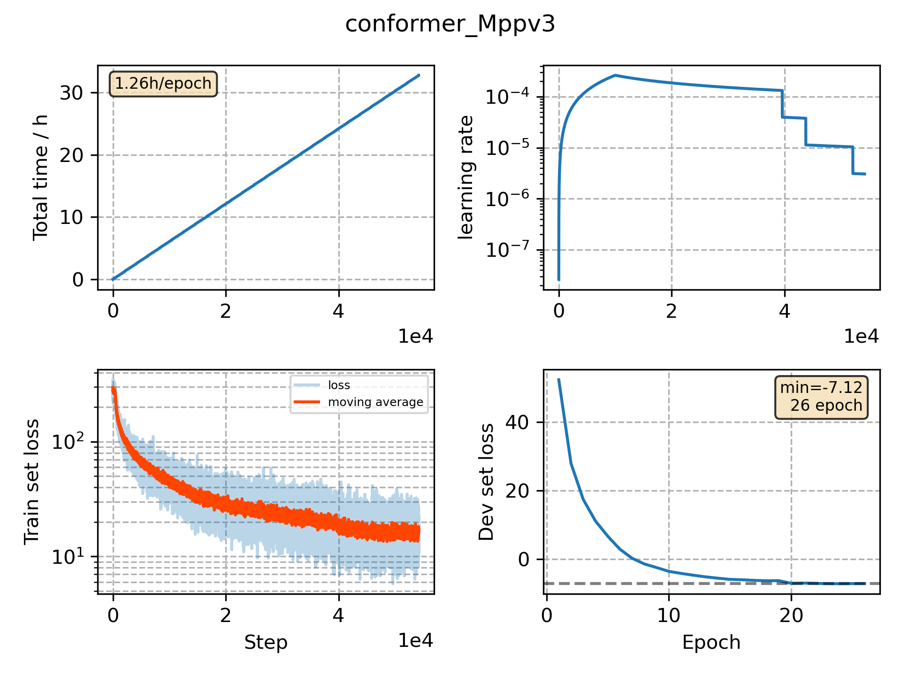

### Basic info

**This part is auto generated, add your details in Appendix**

* Model size/M: 51.82
* GPU info \[8\]
  * \[8\] Tesla P100-SXM2-16GB

### Appendix

* 

### WER
```
%WER 3.61 [ 1899 / 52576, 208 ins, 282 del, 1409 sub ] exp/conformer_Mppv3/decode_test_clean_fglarge/wer_10_0.0
%WER 8.10 [ 4242 / 52343, 472 ins, 696 del, 3074 sub ] exp/conformer_Mppv3/decode_test_other_fglarge/wer_11_0.0
%WER 3.30 [ 1797 / 54402, 179 ins, 324 del, 1294 sub ] exp/conformer_Mppv3/decode_dev_clean_fglarge/wer_10_1.0
%WER 7.97 [ 4061 / 50948, 352 ins, 887 del, 2822 sub ] exp/conformer_Mppv3/decode_dev_other_fglarge/wer_14_0.0
```

### Monitor figure

