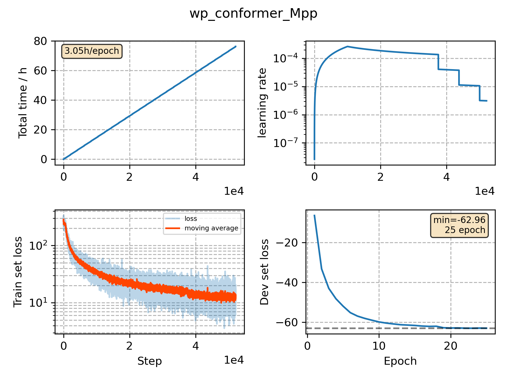

### Basic info

**This part is auto generated, add your details in Appendix**

* Model size/M: 51.85
* GPU info \[8\]
  * \[8\] Tesla P100-SXM2-16GB

### Appendix

* 

### WER
```
%WER 3.59 [ 1889 / 52576, 171 ins, 324 del, 1394 sub ] exp/wp_conformer_Mpp//decode_test_clean_fglarge/wer_10_0.5
%WER 8.37 [ 4383 / 52343, 362 ins, 898 del, 3123 sub ] exp/wp_conformer_Mpp//decode_test_other_fglarge/wer_12_0.5
%WER 3.24 [ 1764 / 54402, 185 ins, 269 del, 1310 sub ] exp/wp_conformer_Mpp//decode_dev_clean_fglarge/wer_10_0.0
%WER 8.20 [ 4178 / 50948, 376 ins, 727 del, 3075 sub ] exp/wp_conformer_Mpp//decode_dev_other_fglarge/wer_12_0.0
```

### Monitor figure

