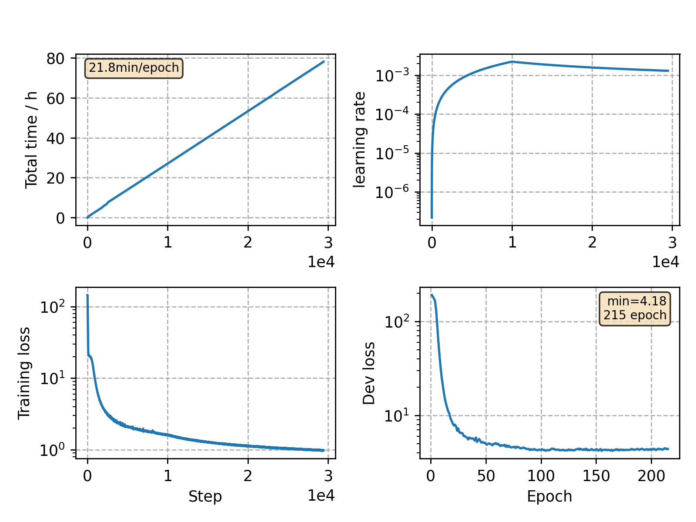

### Basic info

**This part is auto-generated, add your details in Appendix**

* Model size/M: 120.42
* GPU info \[9\]
  * \[9\] GeForce RTX 3090

### Notes

- data prep: kaldi + cmvn by spk
- The model is basically implemented following Google's Conformer-L config.
- We apply a rather larger batch size and accordingly less iterations.

### Result
```
beam size 16
dev_clean       %SER 27.64 | %WER 2.18 [1185 / 54402, 126 ins, 100 del, 959 sub ]
dev_other       %SER 45.32 | %WER 5.34 [2720 / 50948, 251 ins, 218 del, 2251 sub ]
test_clean      %SER 28.55 | %WER 2.39 [1259 / 52576, 145 ins, 101 del, 1013 sub ]
test_other      %SER 46.48 | %WER 5.41 [2830 / 52343, 302 ins, 238 del, 2290 sub ]

beam size 128
dev_clean       %SER 27.64 | %WER 2.18 [ 1188 / 54402, 126 ins, 100 del, 962 sub ]
dev_other       %SER 45.32 | %WER 5.33 [ 2716 / 50948, 250 ins, 217 del, 2249 sub ]
test_clean      %SER 28.51 | %WER 2.40 [ 1262 / 52576, 145 ins, 103 del, 1014 sub ]
test_other      %SER 46.51 | %WER 5.42 [ 2836 / 52343, 302 ins, 236 del, 2298 sub ]

+ transformer lm with large corpus tuned [alpha, beta]
%SER 23.94 | %WER 1.81 [ 983 / 54402, 102 ins, 90 del, 791 sub ]        [0.5625, 1.0]
%SER 36.56 | %WER 4.03 [ 2052 / 50948, 169 ins, 217 del, 1666 sub ]     [0.9375, 1.0]
%SER 24.31 | %WER 1.94 [ 1022 / 52576, 116 ins, 103 del, 803 sub ]      [0.5625, 0.75]
%SER 39.84 | %WER 4.39 [ 2298 / 52343, 229 ins, 255 del, 1814 sub ]     [0.5, 0.5]
```

### Monitor figure

