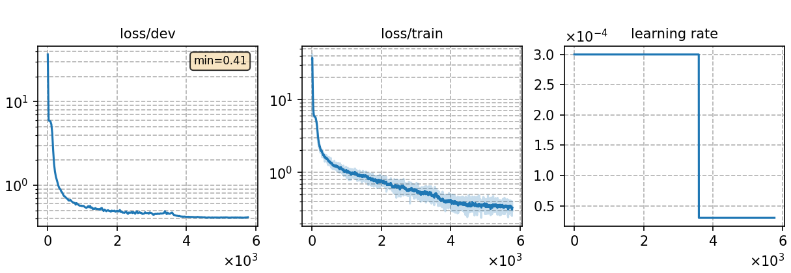

# Fine-tuning Whistle model in subword form with 20 hours Polish data
Author: Ma, Te (mate153125@gmail.com)
### Basic info

__20 hours of `Polish`__ data was used to fine-tune the pretrained __phoneme-based multilingual ASR model__ [`Multi._phoneme_S`](../../../../../cv-lang10/exp/Multilingual/Multi._phoneme_S/readme.md) (which is also called Whistle) in __subword__ form. The training dataset was randomly selected from the Polish dataset sourced from the publicly available [`Common Voice`](https://commonvoice.mozilla.org/) 11.0. 


### Training process

The script [`run.sh`](../../../../../cv-lang10/run.sh) contains the overall model training process.

#### Stage 0: Data preparation
* The data preparation has been implemented in [`monolingual experiments for Polish`](../../../../../cv-lang10/exp/Monolingual/pl/Mono._phoneme_130h/readme.md). Run the script [`subset.sh`](../../../../../cv-lang10/local/tools/subset.sh) to select 20 hours of data randomly.
* The detailed model parameters are detailed in [`config.json`](config.json) and [`hyper-p.json`](hyper-p.json). Dataset paths should be added to the [`metainfo.json`](../../../data/metainfo.json) for efficient management of datasets.

#### Stage 1 to 3: Model training

* For fine-tuning experiment, the output layer of the pretrained model need to be matched to the corresponding language before fine-tuning. We train the tokenizer for Polish and run the script [`unpack_mulingual_param.py`](../../../../../cv-lang10/local/tools/unpack_mulingual_param.py) to implement it. Then configure the parameter `init_model` in `hyper-p.json`.

* To train tokenizer:

        `bash run.sh pl exp/Crosslingual/pl/Whistle_ft_subword_20h --sta 1 --sto 1`
* To fine-tune the model:

        `bash run.sh pl exp/Crosslingual/pl/Whistle_ft_subword_20h --sta 2 --sto 3`
* To plot the training curves:

        `python utils/plot_tb.py exp/Crosslingual/pl/Whistle_ft_subword_20h/log/tensorboard/file -o exp/Crosslingual/pl/Whistle_ft_subword_20h/monitor.png`

|     Monitor figure    |
|:-----------------------:|
||

#### Stage 4: CTC decoding
* To decode with CTC and calculate the %PER:

        `bash run.sh pl exp/Crosslingual/pl/Whistle_ft_subword_20h/ --sta 4 --sto 4`

    ##### %WER
    ```
    test_pl %SER 51.53 | %WER 17.59 [ 10458 / 59464, 1119 ins, 1400 del, 7939 sub ]
    ```

#### Stage 5 to 7: FST decoding
* Before FST decoding, we need to train a language model with the 20 hours training data for each language. The configuration files `config.json` and `hyper-p.json` are in the `lm` of corresponding language directory in monolingual ASR experiment. Notice the distinction between the profiles for training the ASR model and the profiles for training the language model, which have the same name but are in different directories.
* To train a language model:

        `bash run.sh pl exp/Crosslingual/pl/Whistle_ft_subword_20h/ --sta 5 --sto 5`

* To decode with FST and calculate the %WER:

        `bash run.sh pl exp/Crosslingual/pl/Whistle_ft_subword_20h/ --sta 6`

    ##### %WER with 4-gram LM
    ```
    test_pl_ac1.0_lm1.0_wip0.0.hyp  %SER 35.41 | %WER 13.84 [ 8231 / 59464, 724 ins, 1177 del, 6330 sub ]
    ```

### Resources
* The files used or generated in this experiment are available in the following table.

    | Tokenizer | Checkpoint model | Language model | Tensorboard log |
    | ----------- | ----------- | ----------- | ----------- |
    | [`tokenizer_sbw_pl.tknz`](http://cat-ckpt.oss-cn-beijing.aliyuncs.com/cat-multilingual/cv-lang10/dict/pl/tokenizer_bpe500.tknz?OSSAccessKeyId=LTAI5tF9KeigLW4UoLbK9vnJ&Expires=2064483989&Signature=WW%2Fd1ne%2BhXNtkSpkajK4DeJQmrc%3D) | [`best-3.pt`](http://cat-ckpt.oss-cn-beijing.aliyuncs.com/cat-multilingual/cv-lang10/exp/pl/Whistle_ft_subword_20h_best-3.pt?OSSAccessKeyId=LTAI5tF9KeigLW4UoLbK9vnJ&Expires=2064482846&Signature=G6O7IUy%2F2a0QXnwDmZSR4zdev9c%3D) | [`lm_pl_20h.arpa`](http://cat-ckpt.oss-cn-beijing.aliyuncs.com/cat-multilingual/cv-lang10/dict/pl/lm_pl_20h_4gram.arpa?OSSAccessKeyId=LTAI5tF9KeigLW4UoLbK9vnJ&Expires=2064483620&Signature=UKV0NI43%2FzqiAV8VFbhhaLCHde0%3D) | [`tb_log`](http://cat-ckpt.oss-cn-beijing.aliyuncs.com/cat-multilingual/cv-lang10/exp/pl/tb_log_Whistle_ft_subword_20h.tar.gz?OSSAccessKeyId=LTAI5tF9KeigLW4UoLbK9vnJ&Expires=2064482901&Signature=dSgqmIPmUSrDk7ufphlkKTPmDcg%3D) |