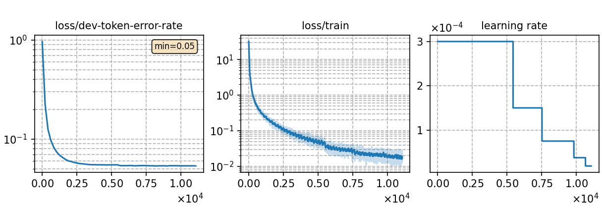

# Fine-tuning LLM-P2G (mT5-base) using data augmentation with 130 hours German noisy phoneme data
Author: Ma, Te (mate153125@gmail.com)
### Basic info

__130 hours of `German`__ noisy phoneme data was generated from the fine-tuned model [`Whistle_ft_de_phoneme_130h`](../../../Crosslingual/de/Whistle_ft_phoneme_130h/readme.md) by beam search decoding with a beam width of __1__. 


### Training process

The script [`run_p2g.sh`](../../../../run_p2g.sh) contains the overall model training process.

#### Stage 0: Data preparation
* The data preparation has been implemented in [`Whistle_ft_phoneme_130h`](../../../Crosslingual/de/Whistle_ft_phoneme_130h/readme.md). After beam search decoding for the S2P model, we run the script [`read_nbest.py`](../../../../local/read_nbest.py) to obtain the noisy phoneme sequence from decoding results.
* The detailed model parameters are in [`config.json`](config.json) and [`hyper-p.json`](hyper-p.json). The generated phoneme data paths should be added to the [`metainfo.json`](../../../data/metainfo.json) for efficient management of datasets.

#### Stage 1 to 3: Model training

* To train tokenizer:

   The tokenizer has been trained in [`Whistle_ft_phoneme_130h`](../../../Crosslingual/de/Whistle_ft_phoneme_130h/readme.md).

* To fine-tune the mT5-base model:

      `bash run.sh de exp/danp/de/1-beam --sta 2 --sto 3`
* To plot the training curves:

      `python utils/plot_tb.py exp/danp/de/1-beam/log/tensorboard/file -o exp/danp/de/1-beam/monitor.png`

|    Monitor figure   |
|:-----------------------:|
||

#### Stage 4: AED decoding
* To decode with AED and calculate the %WER:

      `bash run.sh de exp/danp/de/1-beam --sta 4 --sto 4`

   ##### %WER
   ```
   test_de_phn_mul09      %SER 57.27 | %WER 14.76 [ 21901 / 148339, 2518 ins, 2277 del, 17106 sub ]
   ```

#### Stage 5: LM rescoring

* We use the 4-gram LM trained in [`Whistle_ft_phoneme_130h`](../../../Crosslingual/de/Whistle_ft_phoneme_130h/readme.md) to rescore the decoding results.
To rescoring and calculate the %WER:

      `bash run.sh de exp/danp/de/1-beam --sta 5`

   ##### %WER with 4-gram LM
   ```
   test_de_phn_mul09 %SER 56.61 | %WER 14.39 [ 21351 / 148339, 1786 ins, 3015 del, 16550 sub ]
   ```

### Resources
* The files used or generated in this experiment are available in the following table.

    | Tokenizer | Checkpoint model | Language model | Tensorboard log |
   | ----------- | ----------- | ----------- | ----------- |
   |  [`tokenizer_phn_de.tknz`](http://cat-ckpt.oss-cn-beijing.aliyuncs.com/cat-multilingual/cv-lang10/dict/de/tokenizer_phn_de.tknz?OSSAccessKeyId=LTAI5tF9KeigLW4UoLbK9vnJ&Expires=1780655530&Signature=sZpxg5fqgb7x7mBiO41eASYDm1A%3D) | [`best-3.pt`](http://cat-ckpt.oss-cn-beijing.aliyuncs.com/cat-multilingual/llm-p2g/exp/de/1-beam_best-3.pt?OSSAccessKeyId=LTAI5tF9KeigLW4UoLbK9vnJ&Expires=2064489564&Signature=GdLM6U40NmLxdD0rSgRGut570tc%3D) | [`lm_de_130h.arpa`](http://cat-ckpt.oss-cn-beijing.aliyuncs.com/cat-multilingual/cv-lang10/dict/de/lm_de_130h_4gram.arpa?OSSAccessKeyId=LTAI5tF9KeigLW4UoLbK9vnJ&Expires=2064482365&Signature=d9O7zLIJ1mGmhoXSYo9Vd0i1UDQ%3D) | [`tb_log`](http://cat-ckpt.oss-cn-beijing.aliyuncs.com/cat-multilingual/llm-p2g/exp/de/tb_log_1-beam.tar.gz?OSSAccessKeyId=LTAI5tF9KeigLW4UoLbK9vnJ&Expires=2064489599&Signature=FbFAU88x6%2B6M3AZXqL9nCLpyrUE%3D) |