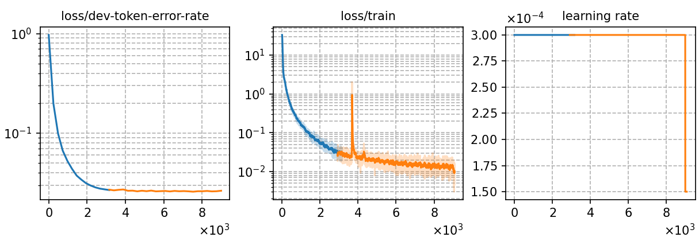

# Fine-tuning LLM-P2G (mT5-base) using data augmentation with 130 hours Polish noisy phoneme data
Author: Ma, Te (mate153125@gmail.com)
### Basic info

__130 hours of `Polish`__ noisy phoneme data was generated from the fine-tuned model [`Whistle_ft_pl_phoneme_130h`](../../../Crosslingual/pl/Whistle_ft_phoneme_130h/readme.md) by beam search decoding with a beam width of __1__. 


### Training process

The script [`run_p2g.sh`](../../../../run_p2g.sh) contains the overall model training process.

#### Stage 0: Data preparation
* The data preparation has been implemented in [`Whistle_ft_pl_phoneme_130h`](../../../Crosslingual/pl/Whistle_ft_phoneme_130h/readme.md). After beam search decoding for the S2P model, we run the script [`read_nbest.py`](../../../../local/read_nbest.py) to obtain the noisy phoneme sequence from beam searching results.
* The detailed model parameters are in [`config.json`](config.json) and [`hyper-p.json`](hyper-p.json). The generated phoneme data paths should be added to the [`metainfo.json`](../../../data/metainfo.json) for efficient management of datasets.

#### Stage 1 to 3: Model training


* To train tokenizer:

    The tokenizer has been trained in [`Whistle_ft_pl_phoneme_130h`](../../../Crosslingual/pl/Whistle_ft_phoneme_130h/readme.md).

* To fine-tune the mT5-base model:

        `bash run.sh pl exp/danp/pl/1-beam --sta 2 --sto 3`
* To plot the training curves:

        `python utils/plot_tb.py exp/danp/pl/1-beam/log/tensorboard/file -o exp/danp/pl/1-beam/monitor.png`

|     Monitor figure    |
|:-----------------------:|
||

#### Stage 4: AED decoding
* To decode with AED and calculate the %WER:

        `bash run.sh pl exp/danp/pl/1-beam/ --sta 4 --sto 4`

    ##### %WER
    ```
    test_pl_phn  %SER 16.98 | %WER 5.71 [ 3397 / 59464, 564 ins, 359 del, 2474 sub ]
    ```

#### Stage 5: LM rescoring

* We use the 4-gram LM trained in [`Whistle_ft_pl_phoneme_130h`](../../../Crosslingual/pl/Whistle_ft_phoneme_130h/readme.md) to rescore the decoding results.
To rescoring and calculate the %WER:

        `bash run.sh pl exp/Crosslingual/pl/1-beam/ --sta 5`

    ##### %WER with 4-gram LM
    ```
    test_pl_phn_lm0.02 %SER 15.60 | %WER 5.04 [ 2996 / 59464, 228 ins, 536 del, 2232 sub ]
    ```

### Resources
* The files used or generated in this experiment are available in the following table.

     | tokenizer | Checkpoint model | Language model | Tensorboard log |
    | ----------- | ----------- | ----------- | ----------- |
    | [`tokenizer_phn_pl.tknz`](http://cat-ckpt.oss-cn-beijing.aliyuncs.com/cat-multilingual/cv-lang10/dict/pl/tokenizer_phn_pl.tknz?OSSAccessKeyId=LTAI5tF9KeigLW4UoLbK9vnJ&Expires=2064482941&Signature=6E0P6xis%2FBTZjIkbdIaLS%2F%2Br%2FyU%3D) | [`best-3.pt`](http://cat-ckpt.oss-cn-beijing.aliyuncs.com/cat-multilingual/llm-p2g/exp/pl/1-beam_best-3.pt?OSSAccessKeyId=LTAI5tF9KeigLW4UoLbK9vnJ&Expires=2064492925&Signature=LlL9Ii84MUPa90cc2wCIy%2BfxxlA%3D) | [`lm_pl_130h.arpa`](http://cat-ckpt.oss-cn-beijing.aliyuncs.com/cat-multilingual/cv-lang10/dict/pl/lm_pl_130h_4gram.arpa?OSSAccessKeyId=LTAI5tF9KeigLW4UoLbK9vnJ&Expires=2064492786&Signature=R2c0spDVXOPoMSpaC35EvV9Nt7k%3D) | [`tb_log`](http://cat-ckpt.oss-cn-beijing.aliyuncs.com/cat-multilingual/llm-p2g/exp/pl/tb_log_1-beam.tar.gz?OSSAccessKeyId=LTAI5tF9KeigLW4UoLbK9vnJ&Expires=2064492949&Signature=GchUDaOLHHjzLJFJBH3pUrVqUdU%3D) |