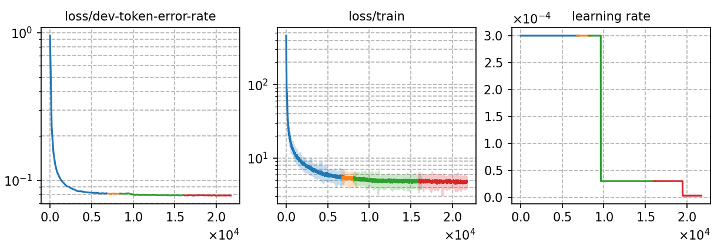

# Fine-tuning LLM-P2G (mT5-base) using Top-K marginalized training and decoding with 130 hours German speech data
Author: Ma, Te (mate153125@gmail.com)
### Basic info

__130 hours of `German`__ speech data and the fine-tuned model [`Whistle_ft_de_phoneme_130h`](../../../Crosslingual/de/Whistle_ft_phoneme_130h/readme.md) are used to generate phoneme sequences by beam search decoding in real time for TKM. For training, the beam width is __32__ and only __8__ phoneme sequences are randomly selected as candidates in TKM. For decoding, beam search with beam width of __8__ is used and the top-8 sequences are used in TKM.


### Training process

The script [`run_p2g.sh`](../../../../run_p2g.sh) contains the overall model training process.

#### Stage 0: Data preparation
* The data preparation has been implemented in [`Whistle_ft_phoneme_130h`](../../../Crosslingual/de/Whistle_ft_phoneme_130h/readme.md). 
* The detailed model parameters are in [`config.json`](config.json) and [`hyper-p.json`](hyper-p.json). The generated phoneme data paths should be added to the [`metainfo.json`](../../../data/metainfo.json) for efficient management of datasets.

#### Stage 1 to 3: Model training

* To train tokenizer:

    The tokenizer has been trained in [`Whistle_ft_phoneme_130h`](../../../Crosslingual/de/Whistle_ft_phoneme_130h/readme.md).

* To fine-tune the mT5-base model:

        `bash run.sh de exp/tkm/de/random-8-of-32-beam --sta 2 --sto 3`
* To plot the training curves:

        `python utils/plot_tb.py exp/tkm/de/random-8-of-32-beam/log/tensorboard/file -o exp/tkm/de/random-8-of-32-beam/monitor.png`

|     Monitor figure    |
|:-----------------------:|
||

#### Stage 4: AED decoding
* To decode with AED and calculate the %WER:

        `bash run.sh de exp/tkm/de/random-8-of-32-beam --sta 4 --sto 4`

    ##### %WER
    ```
    test_de %SER 52.92 | %WER 13.44 [ 19939 / 148339, 2212 ins, 2111 del, 15616 sub ]
    ```

#### Stage 5: LM rescoring

* We use the 4-gram LM trained in [`Whistle_ft_phoneme_130h`](../../../Crosslingual/de/Whistle_ft_phoneme_130h/readme.md) to rescore the decoding results.
To rescoring and calculate the %WER:

        `bash run.sh de exp/tkm/de/random-8-of-32-beam --sta 5`

    ##### %WER with 4-gram LM
    ```
    test_de %SER 51.69 | %WER 13.03 [ 19331 / 148339, 1478 ins, 2843 del, 15010 sub ]
    ```

### Resources
* The files used or generated in this experiment are available in the following table.

     | Tokenizer | Checkpoint model | Language model | Tensorboard log |
    | ----------- | ----------- | ----------- | ----------- |
    |  [`tokenizer_phn_de.tknz`](http://cat-ckpt.oss-cn-beijing.aliyuncs.com/cat-multilingual/cv-lang10/dict/de/tokenizer_phn_de.tknz?OSSAccessKeyId=LTAI5tF9KeigLW4UoLbK9vnJ&Expires=1780655530&Signature=sZpxg5fqgb7x7mBiO41eASYDm1A%3D) | [`best-3.pt`](http://cat-ckpt.oss-cn-beijing.aliyuncs.com/cat-multilingual/llm-p2g/exp/de/random-8-of-32-beam_best-3.pt?OSSAccessKeyId=LTAI5tF9KeigLW4UoLbK9vnJ&Expires=2064492042&Signature=RYwpU6I0B9XvwDJAfYdwj8Hy3%2Bw%3D) | [`lm_de_130h.arpa`](http://cat-ckpt.oss-cn-beijing.aliyuncs.com/cat-multilingual/cv-lang10/dict/de/lm_de_130h_4gram.arpa?OSSAccessKeyId=LTAI5tF9KeigLW4UoLbK9vnJ&Expires=2064482365&Signature=d9O7zLIJ1mGmhoXSYo9Vd0i1UDQ%3D) | [`tb_log`](http://cat-ckpt.oss-cn-beijing.aliyuncs.com/cat-multilingual/llm-p2g/exp/de/tb_log_random-8-of-32-beam.tar.gz?OSSAccessKeyId=LTAI5tF9KeigLW4UoLbK9vnJ&Expires=2064492070&Signature=ji%2Bkcda%2B6TQR04xkGjPFOrTF3WM%3D) |
