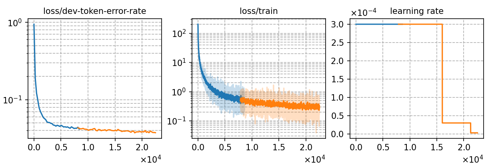

# Fine-tuning LLM-P2G (mT5-base) using Top-K marginalized training and decoding with 130 hours Polish speech data
Author: Ma, Te (mate153125@gmail.com)
### Basic info

__130 hours of `Polish`__ speech data and the fine-tuned model [`Whistle_ft_pl_phoneme_130h`](../../../Crosslingual/pl/Whistle_ft_phoneme_130h/readme.md) are used to generate phoneme sequences by beam search decoding in real time for TKM. The beam width is __32__ and the top-32 phoneme sequences are candidates for training and decoding in TKM. 


### Training process

The script [`run_p2g.sh`](../../../../run_p2g.sh) contains the overall model training process.

#### Stage 0: Data preparation
* The data preparation has been implemented in [`Whistle_ft_phoneme_130h`](../../../Crosslingual/pl/Whistle_ft_phoneme_130h/readme.md). 
* The detailed model parameters are in [`config.json`](config.json) and [`hyper-p.json`](hyper-p.json). The generated phoneme data paths should be added to the [`metainfo.json`](../../../data/metainfo.json) for efficient management of datasets.

#### Stage 1 to 3: Model training

* To train tokenizer:

    The tokenizer has been trained in [`Whistle_ft_phoneme_130h`](../../../Crosslingual/pl/Whistle_ft_phoneme_130h/readme.md).

* To fine-tune the mT5-base model:

        `bash run.sh pl exp/tkm/pl/top-32-beam --sta 2 --sto 3`
* To plot the training curves:

        `python utils/plot_tb.py exp/tkm/pl/top-32-beam/log/tensorboard/file -o exp/tkm/pl/top-32-beam/monitor.png`

|     Monitor figure    |
|:-----------------------:|
||

#### Stage 4: AED decoding
* To decode with AED and calculate the %WER:

        `bash run.sh pl exp/tkm/pl/top-32-beam --sta 4 --sto 4`

    ##### %WER
    ```
    %SER 70.38 | %WER 16.55 [ 9841 / 59464, 4399 ins, 217 del, 5225 sub ]
    ```

#### Stage 5: LM rescoring

* We use the 4-gram LM trained in [`Whistle_ft_phoneme_130h`](../../../Crosslingual/pl/Whistle_ft_phoneme_130h/readme.md) to rescore the decoding results.
To rescoring and calculate the %WER:

        `bash run.sh pl exp/tkm/pl/top-32-beam --sta 5`

    ##### %WER with 4-gram LM
    ```
    test_pl %SER 69.68 | %WER 16.12 [ 9586 / 59464, 4359 ins, 226 del, 5001 sub ]
    ```

### Resources
* The files used or generated in this experiment are available in the following table.

     | Tokenizer | Checkpoint model | Language model | Tensorboard log |
    | ----------- | ----------- | ----------- | ----------- |
    | [`tokenizer_phn_pl.tknz`](http://cat-ckpt.oss-cn-beijing.aliyuncs.com/cat-multilingual/cv-lang10/dict/pl/tokenizer_phn_pl.tknz?OSSAccessKeyId=LTAI5tF9KeigLW4UoLbK9vnJ&Expires=2064482941&Signature=6E0P6xis%2FBTZjIkbdIaLS%2F%2Br%2FyU%3D) | [`best-3.pt`](http://cat-ckpt.oss-cn-beijing.aliyuncs.com/cat-multilingual/llm-p2g/exp/pl/top-32-beam_best-3.pt?OSSAccessKeyId=LTAI5tF9KeigLW4UoLbK9vnJ&Expires=2064495753&Signature=PVO3eV3LZDHp%2FZCmVzIOZuZ%2B8s4%3D) | [`lm_pl_130h.arpa`](http://cat-ckpt.oss-cn-beijing.aliyuncs.com/cat-multilingual/cv-lang10/dict/pl/lm_pl_130h_4gram.arpa?OSSAccessKeyId=LTAI5tF9KeigLW4UoLbK9vnJ&Expires=2064492786&Signature=R2c0spDVXOPoMSpaC35EvV9Nt7k%3D) | [`tb_log`](http://cat-ckpt.oss-cn-beijing.aliyuncs.com/cat-multilingual/llm-p2g/exp/pl/tb_log_top-32-beam.tar.gz?OSSAccessKeyId=LTAI5tF9KeigLW4UoLbK9vnJ&Expires=2064495778&Signature=ByVYJLvKTTwnNgRgxuUu8KSGBnE%3D) |
