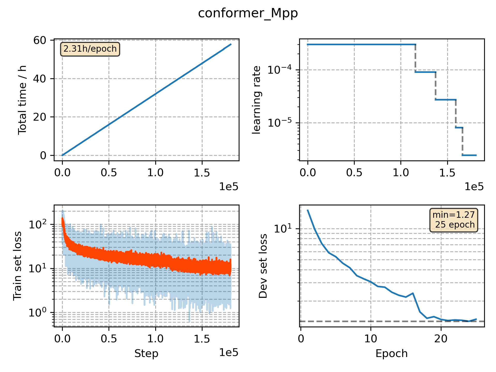

### Basic info

**This part is auto generated, add your details in Appendix**

* Model size/M: 51.82
* GPU info \[8\]
  * \[8\] Tesla P100-SXM2-16GB

### Appendix

* 

### WER
```
%WER 12.1 | 4459 42989 | 89.7 7.5 2.8 1.7 12.1 46.1 | exp/dev_conformer_Mpp//decode_eval2000_sw1_fsh_fg/score_11_0.0/eval2000.ctm.filt.sys
%WER 16.1 | 2628 21594 | 86.3 10.2 3.6 2.4 16.1 50.5 | exp/dev_conformer_Mpp//decode_eval2000_sw1_fsh_fg/score_11_0.0/eval2000.ctm.callhm.filt.sys
%WER 7.9 | 1831 21395 | 93.1 4.8 2.1 1.0 7.9 39.9 | exp/dev_conformer_Mpp//decode_eval2000_sw1_fsh_fg/score_11_0.0/eval2000.ctm.swbd.filt.sys
```

### Monitor figure

