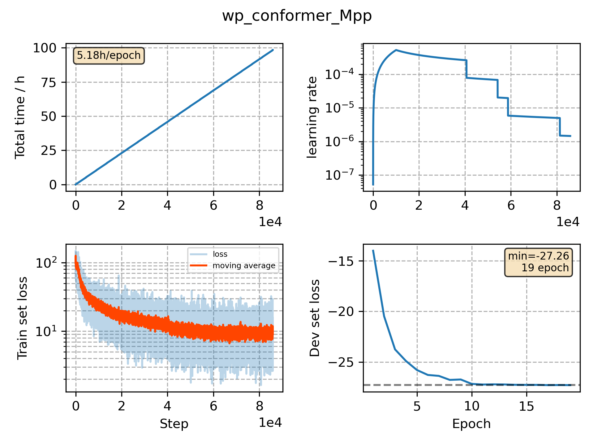

### Basic info

**This part is auto generated, add your details in Appendix**

* Model size/M: 51.85
* GPU info \[8\]
  * \[8\] Tesla P100-SXM2-16GB

### Appendix

* 

### WER
```
%WER 12.7 | 4459 42989 | 89.0 7.7 3.3 1.7 12.7 47.4 | exp/wp_conformer_Mpp/decode_eval2000_sw1_fsh_fg/score_10_0.0/eval2000.ctm.filt.sys
%WER 8.7 | 1831 21395 | 92.5 5.1 2.5 1.2 8.7 40.8 | exp/wp_conformer_Mpp/decode_eval2000_sw1_fsh_fg/score_11_0.0/eval2000.ctm.swbd.filt.sys
%WER 16.5 | 2628 21594 | 85.4 9.9 4.7 1.9 16.5 51.9 | exp/wp_conformer_Mpp/decode_eval2000_sw1_fsh_fg/score_12_0.0/eval2000.ctm.callhm.filt.sys
```

### Monitor figure

