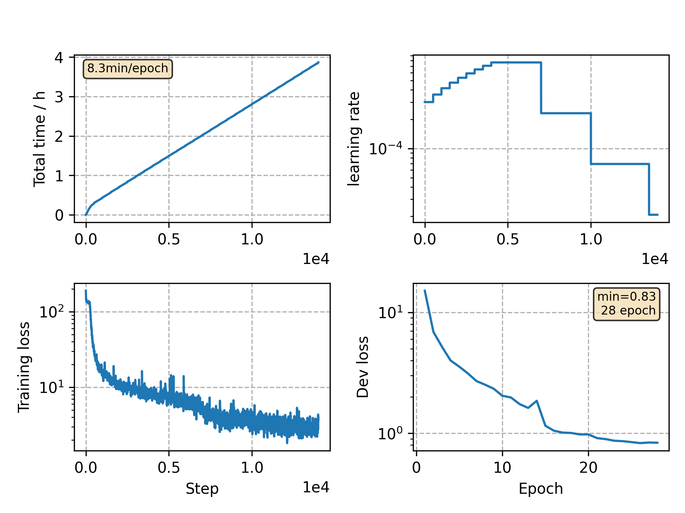

### Basic info

**This part is auto generated, add your details in Appendix**

* Model size/M: 7.85
* GPU info \[5\]
  * \[4\] NVIDIA GeForce GTX 1080
  * \[1\] NVIDIA GeForce GTX 1080 Ti

### Appendix

* This demo shows how to add SpecAug(Conformer) in training.

### WER
```
%WER 6.93 [ 67692 / 976163, 3354 ins, 12186 del, 52152 sub ] exp/stop_conformer/decode_test/cer_7_1.0
%WER 18.48 [ 14991 / 81139, 79 ins, 922 del, 13990 sub ] exp/stop_conformer/decode_test/wer_8_1.0
```

### Monitor figure

