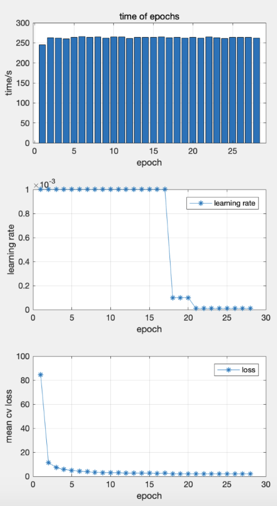

THCHS30 RESULT
---------------

-4*GTX1080 ti 

--ctc_crf 

--tr_data_path=data/train/ 

--dev_data_path=data/dev/ 

--den_lm_fst_path=data/den_meta/den_lm.fst  

--gpu_batch_size=64 

--feature_size=120 

--output_unit=218 

--hdim=512 

--dropout=0.5 

| epoch | time   | lr      | mean-cv-loss  |
| ----- | ------ | ------- | ------------- |
| 1     | 244.99 | 0.001   | 84.4949171884 |
| 2     | 263.09 | 0.001   | 11.5005978176 |
| 3     | 261.61 | 0.001   | 7.30604062762 |
| 4     | 260.37 | 0.001   | 5.66556712559 |
| 5     | 264.00 | 0.001   | 4.99065181187 |
| 6     | 265.63 | 0.001   | 4.24960981097 |
| 7     | 264.13 | 0.001   | 3.7948853629  |
| 8     | 264.60 | 0.001   | 3.31777245658 |
| 9     | 262.21 | 0.001   | 3.11965124948 |
| 10    | 264.69 | 0.001   | 2.88841029576 |
| 11    | 264.74 | 0.001   | 2.94997406006 |
| 12    | 260.86 | 0.001   | 2.62763432094 |
| 13    | 264.08 | 0.001   | 2.68043191092 |
| 14    | 263.68 | 0.001   | 2.70405306135 |
| 15    | 263.98 | 0.001   | 2.56774248396 |
| 16    | 264.39 | 0.001   | 2.47363226754 |
| 17    | 263.15 | 0.001   | 2.5302494594  |
| 18    | 263.48 | 0.0001  | 2.13829095023 |
| 19    | 262.09 | 0.0001  | 2.05187334333 |
| 20    | 263.67 | 0.0001  | 2.05642373221 |
| 21    | 261.97 | 0.00001 | 2.04727663313 |
| 22    | 264.78 | 0.00001 | 2.04024778094 |
| 23    | 262.72 | 0.00001 | 2.03403690883 |
| 24    | 261.48 | 0.00001 | 2.0312903268  |
| 25    | 264.00 | 0.00001 | 2.02525547573 |
| 26    | 263.61 | 0.00001 | 2.02241570609 |
| 27    | 263.68 | 0.00001 | 2.01969419207 |
| 28    | 261.99 | 0.00001 | 2.02067347935 |

Best CER：

%WER 20.31 [ 16479 / 81139, 117 ins, 937 del, 15425 sub ]

%SER 98.56 [ 2459 / 2495 ]

exp/decode_test/lattice/cer_10

