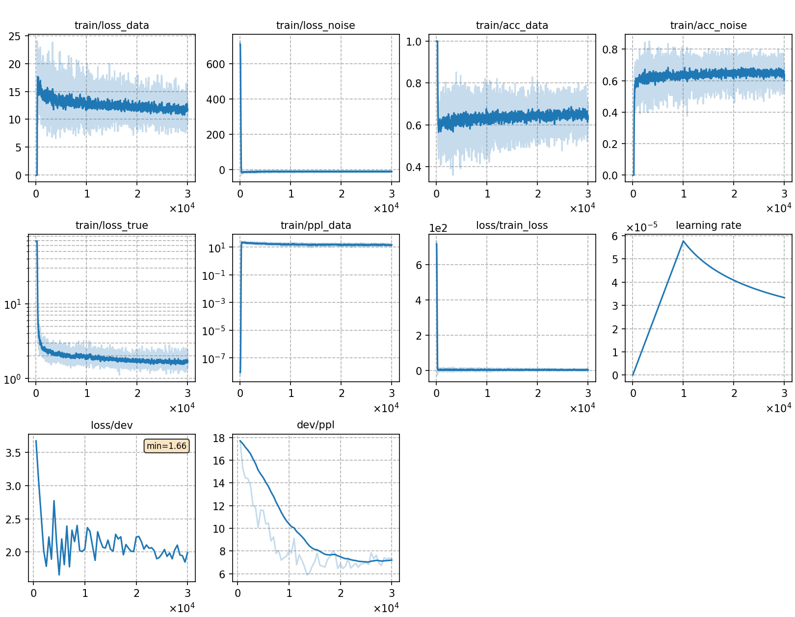

# Train GN-ELM with DNCE

## Notes

* For other **ELM experiments with different settings**, we follow the same training framework above and only modify some configurations.
Please refer to
  - [Train TRF-LM with DNCE](../TRF-LM-DNCE/readme.md)

## Result
The trained GN-ELM is capable of rescoring ASR outputs. We rescore the N-best lists generated by [rnnt](../../../exp/train_l/rnnt-v1). The N-best lists and other test files can be downloaded from [wenet_files](https://cat-ckpt.oss-cn-beijing.aliyuncs.com/liuhong/wenet.tar).

We try 3 different energy functions mentioned in the second note. The backbone of 'sumtargetlogit' is GPT-2, while that of the other two functions is BERT. The results are as follows:

|CER type     | SumTargetLogit |  Hidden2Scalar  | SumTokenLogit |
| -------     | -------- | ----------- | ----------- |
| TEST-NET   | 9.03     |  8.98       |  8.81       |
| TEST-MEETING| 16.02     |  15.69       |  15.47       | 

'SumTokenLogit' achieves the best results and the training curve is as follows:

|     training curve    |
|:-----------------------:|
||
