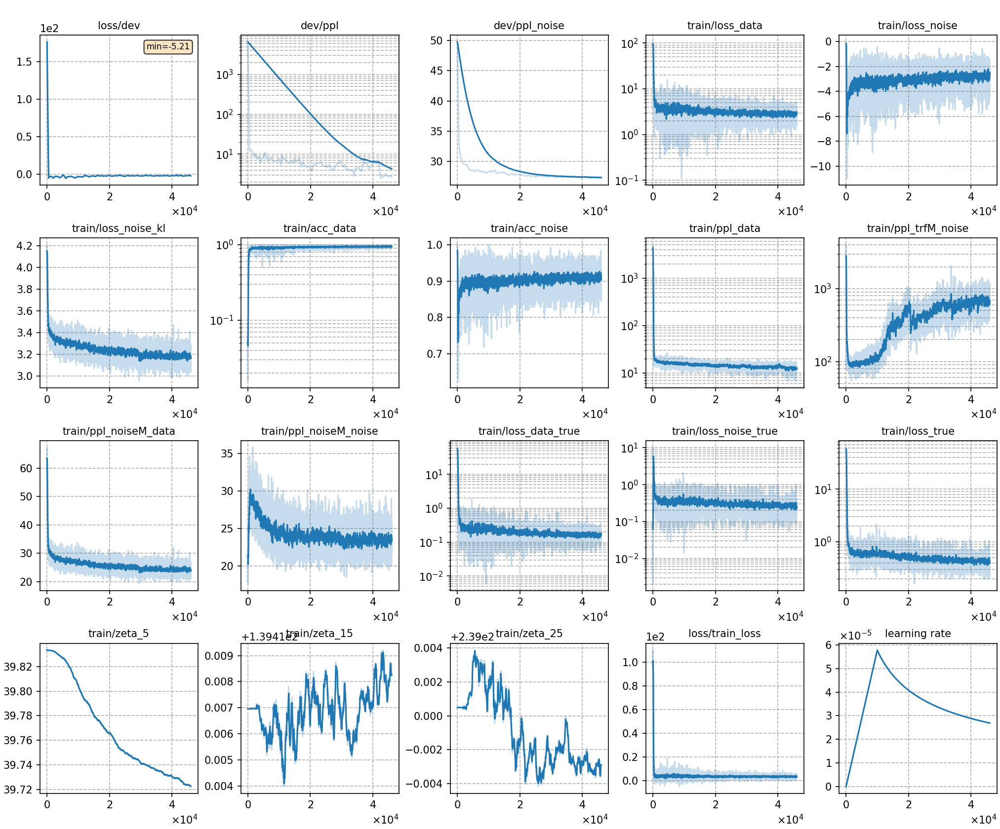

# Train TRF-LM with DNCE

## Result
We also try 3 different energy functions, whose results are as follows:

| CER type     | SumTargetLogit | Hidden2Scalar | SumTokenLogit |
| ------------ | -------------- | ------------- | ------------- |
| in-domain    | 8.97           | 8.95          | 9.00          |
| cross-domain | 15.77          | 15.67         | 15.65         |

The training curve of the best model (Hidden2Scalar) is shown below.

|     training curve    |
|:-----------------------:|
||