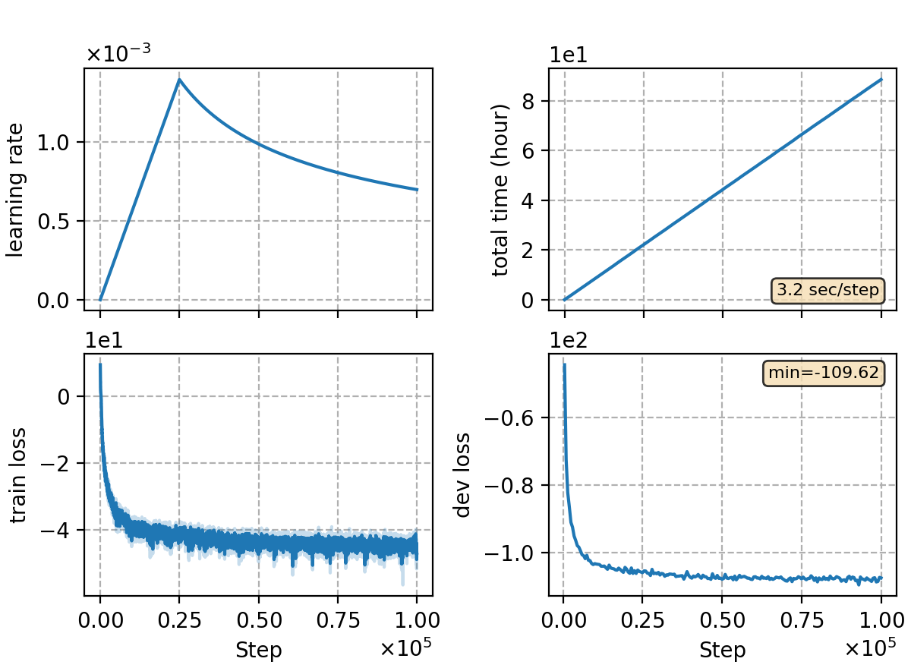

### Basic info

**This part is auto-generated, add your details in Appendix**

* Model size/M: 83.44
* GPU info \[18\]
  * \[18\] NVIDIA GeForce RTX 3090

### Notes

- ctc-crf training
- This experiment is originally conducted on old code base, so it's not guaranteed to precisely reproduce the results.
- experiment is conducted on old code base.
    1. Prepare lexicon with `bash utils/tool/prep_bigcidian.sh`;
    2. Please follow [template](../TEMPLATE/exp/asr-ctc-crf) to do ctc-crf training and decoding.

### Result
```
%WER 8.47 [ 19506 / 230201, 3088 ins, 4956 del, 11462 sub ] [PARTIAL] exp/crf-v5/phn-3-word/dev-17-8/cer_6_0.0
%WER 10.51 [ 43528 / 414187, 3914 ins, 7826 del, 31788 sub ] exp/crf-v5/phn-3-word/test_net-17-8/cer_7_0.5
%WER 16.21 [ 35721 / 220326, 3136 ins, 12544 del, 20041 sub ] exp/crf-v5/phn-3-word/test_meeting-17-8/cer_6_0.0
%WER 5.29 [ 5544 / 104765, 326 ins, 251 del, 4967 sub ] exp/crf-v5/phn-3-word/aishell-test-17-8/cer_9_1.0

speechio
%WER 7.20 [ 1711 / 23752, 181 ins, 662 del, 868 sub ] exp/crf-v5/phn-3-word/speechio_asr_zh00000-17-8/cer_3_0.0
%WER 2.49 [ 3567 / 143174, 137 ins, 271 del, 3159 sub ] exp/crf-v5/phn-3-word/speechio_asr_zh00001-17-8/cer_7_0.5
%WER 7.10 [ 3659 / 51533, 576 ins, 726 del, 2357 sub ] exp/crf-v5/phn-3-word/speechio_asr_zh00002-17-8/cer_5_0.5
%WER 4.14 [ 1535 / 37055, 67 ins, 75 del, 1393 sub ] exp/crf-v5/phn-3-word/speechio_asr_zh00003-17-8/cer_9_1.0
%WER 4.78 [ 1790 / 37452, 192 ins, 438 del, 1160 sub ] exp/crf-v5/phn-3-word/speechio_asr_zh00004-17-8/cer_6_0.5
%WER 7.56 [ 7044 / 93117, 743 ins, 2435 del, 3866 sub ] exp/crf-v5/phn-3-word/speechio_asr_zh00005-17-8/cer_4_0.5
%WER 18.53 [ 4866 / 26262, 542 ins, 578 del, 3746 sub ] exp/crf-v5/phn-3-word/speechio_asr_zh00006-17-8/cer_6_0.0
%WER 19.68 [ 3690 / 18746, 401 ins, 632 del, 2657 sub ] exp/crf-v5/phn-3-word/speechio_asr_zh00007-17-8/cer_6_0.0
```

### Monitor figure

