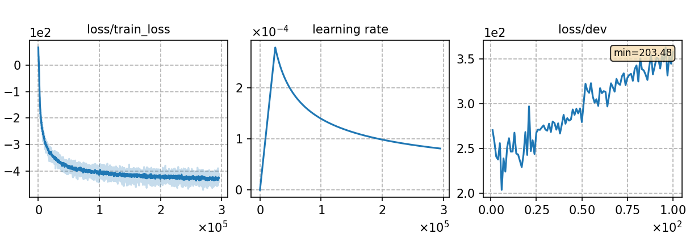

### Basic info

**This part is auto-generated, add your details in Appendix**

* Model size/M: 83.45
* GPU info \[10\]
  * \[10\] NVIDIA GeForce RTX 3090

### Notes

- Data prepare and decode are conduct in CAT-v2 manner, thus the reproducibility is not guaranteed.
- The dev set was processed in error, so the monitor plotting of dev loss is meaningless. However, this didn't affect the result, since I take the last 10 checkpoints for model averaging.

### Result

```
%WER 11.15 [ 36536 / 327711, 2727 ins, 12405 del, 21404 sub ] exp/crf-v1/phn-tgprune/dev/cer_7_0.0
%WER 13.38 [ 55453 / 414392, 2590 ins, 12334 del, 40529 sub ] exp/crf-v1/phn-tgprune/test_net/cer_9_0.0
%WER 20.52 [ 45219 / 220338, 1968 ins, 17993 del, 25258 sub ] exp/crf-v1/phn-tgprune/test_meeting/cer_7_0.0
%WER 6.43 [ 13199 / 205341, 412 ins, 548 del, 12239 sub ] exp/crf-v1/decodelm/aishell-dev-20-20/cer_11_1.0
%WER 6.83 [ 7153 / 104765, 191 ins, 430 del, 6532 sub ] exp/crf-v1/phn-tgprune/aishell-test/cer_12_1.0
```

### Monitor figure

