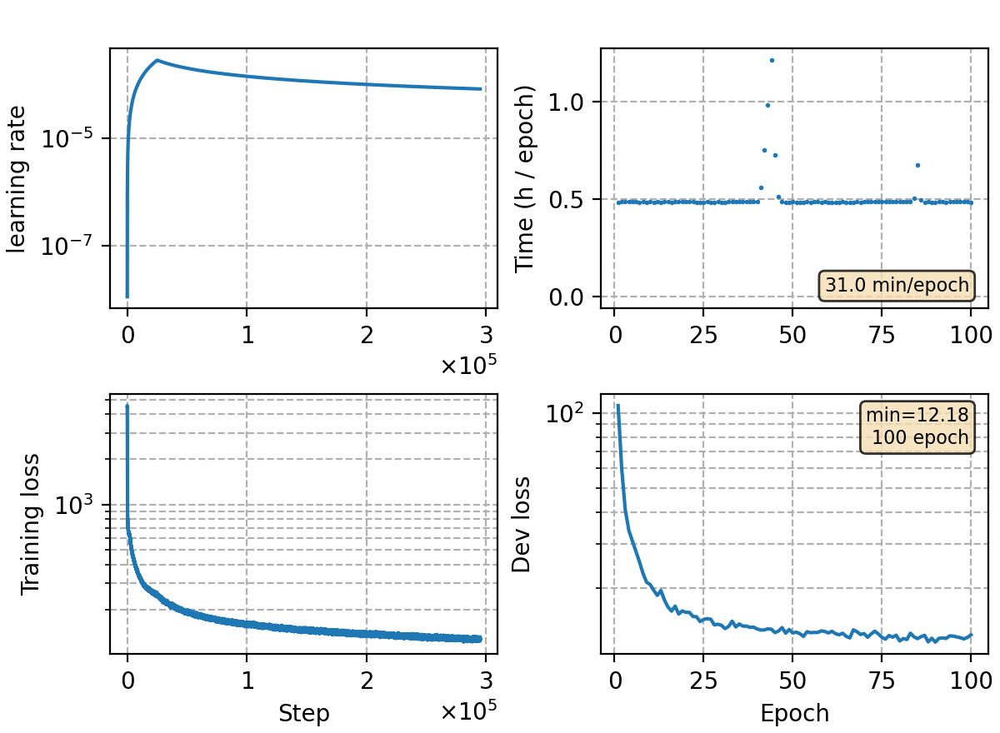

### Basic info

**This part is auto-generated, add your details in Appendix**

* Model size/M: 86.01
* GPU info \[7\]
  * \[7\] NVIDIA GeForce RTX 3090

### Notes

- CTC topo of `rnnt-v1`

### Result
```
no lm
dev             %SER 75.46 | %CER 11.80 [ 39003 / 330498, 1282 ins, 14446 del, 23275 sub ]
test_net        %SER 70.72 | %CER 14.28 [ 59372 / 415746, 2004 ins, 12692 del, 44676 sub ]
test_meeting    %SER 94.50 | %CER 22.23 [ 48983 / 220385, 1622 ins, 17767 del, 29594 sub ]
aishell-test    %SER 61.05 | %CER 9.05 [ 9478 / 104765, 347 ins, 201 del, 8930 sub ]
```

|     training process    |
|:-----------------------:|
||
