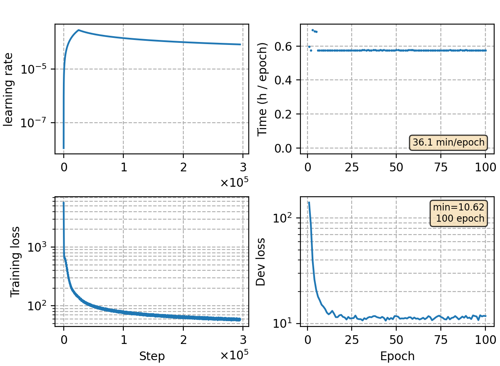

### Basic info

**This part is auto-generated, add your details in Appendix**

* Model size/M: 91.27
* GPU info \[10\]
  * \[10\] NVIDIA GeForce RTX 3090

### Appendix

* trained on wenet speech M subset (1000 hour speech)

### Result
```
beamsize 128 no lm
dev             %SER 71.10 | %CER 11.14 [ 36833 / 330498, 1284 ins, 16210 del, 19339 sub ]
test_net        %SER 65.51 | %CER 12.75 [ 52991 / 415746, 1942 ins, 12914 del, 38135 sub ]
test_meeting    %SER 91.74 | %CER 20.88 [ 46025 / 220385, 1236 ins, 22703 del, 22086 sub ]
aishell-dev     %SER 45.05 | %CER 6.32 [ 12985 / 205341, 420 ins, 248 del, 12317 sub ]
aishell-test    %SER 49.97 | %CER 7.22 [ 7562 / 104765, 253 ins, 204 del, 7105 sub ]
```


### Monitor figure

